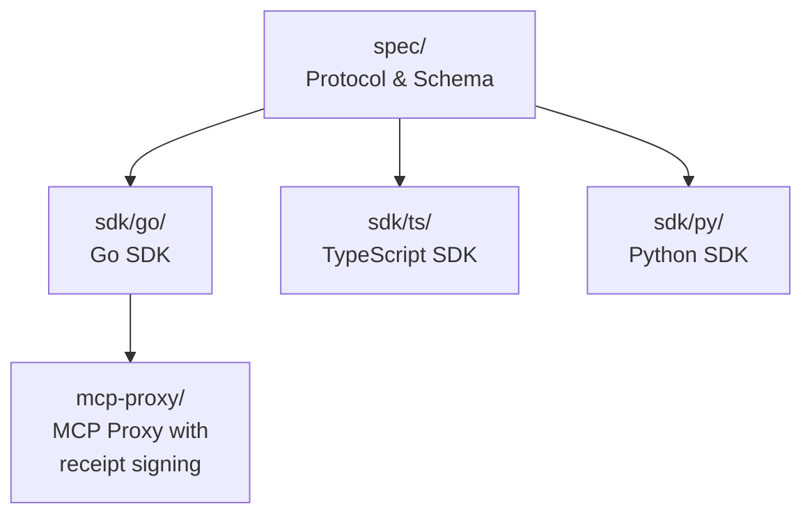

<div align="center">

# Agent Receipts

**Cryptographically signed audit trails for AI agent actions**

[](https://github.com/agent-receipts/ar/actions/workflows/sdk-go.yml)
[](https://github.com/agent-receipts/ar/actions/workflows/sdk-ts.yml)
[](https://github.com/agent-receipts/ar/actions/workflows/sdk-py.yml)
[](LICENSE)

</div>

---

## What is this?

Agent Receipts is an open protocol and set of SDKs for producing cryptographically signed, tamper-evident records of AI agent actions. Every action an agent takes -- API calls, tool use, data access -- gets a verifiable receipt that can be audited later.

## Architecture



## Quick start

### Go

```bash
go get github.com/agent-receipts/ar/sdk/go
```

```go
import receipt "github.com/agent-receipts/ar/sdk/go/receipt"

r, _ := receipt.New(receipt.WithAction("tool_call", payload))
signed, _ := r.Sign(privateKey)
```

### TypeScript

```bash
npm install @agent-receipts/sdk-ts
```

```typescript
import { Receipt } from "@agent-receipts/sdk-ts";

const receipt = await Receipt.create({ action: "tool_call", payload });
const signed = await receipt.sign(privateKey);
```

### Python

```bash
pip install agent-receipts
```

```python
from agent_receipts import Receipt

receipt = Receipt.create(action="tool_call", payload=payload)
signed = receipt.sign(private_key)
```

## Project layout

| Directory | Description |
|-----------|-------------|
| [`spec/`](spec/) | Protocol specification, JSON schemas, governance |
| [`sdk/go/`](sdk/go/) | Go SDK |
| [`sdk/ts/`](sdk/ts/) | TypeScript SDK |
| [`sdk/py/`](sdk/py/) | Python SDK |
| [`mcp-proxy/`](mcp-proxy/) | MCP proxy with receipt signing, policy engine, intent tracking |
| [`cross-sdk-tests/`](cross-sdk-tests/) | Cross-language verification tests |

## Integrations

| Project | Description |
|---------|-------------|
| [openclaw](https://github.com/agent-receipts/openclaw) | Agent Receipts plugin for OpenClaw |

## Contributing

See [CONTRIBUTING.md](CONTRIBUTING.md) for development setup and PR guidelines.

## Security

See [SECURITY.md](SECURITY.md) to report vulnerabilities.

## License

Apache License 2.0 -- see [LICENSE](LICENSE).
The protocol specification in `spec/` is licensed under MIT.
