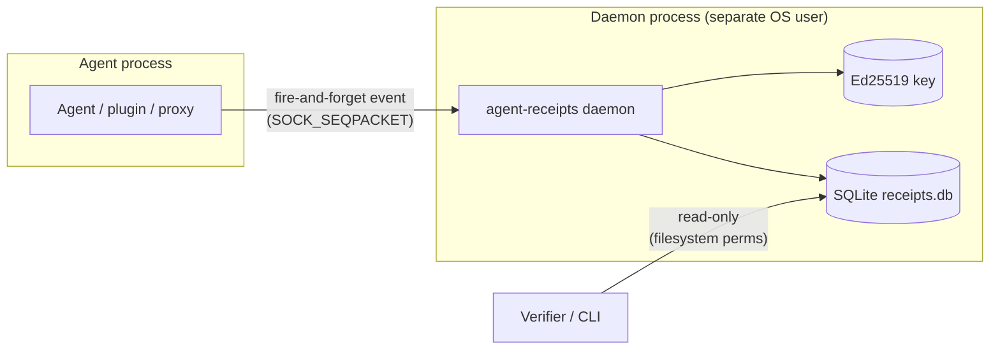
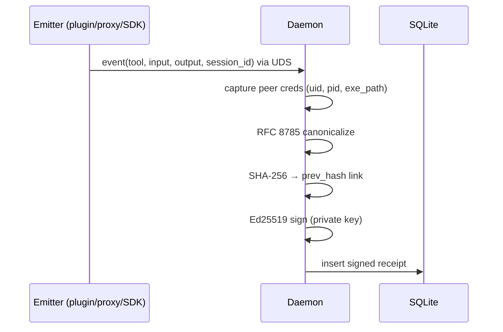
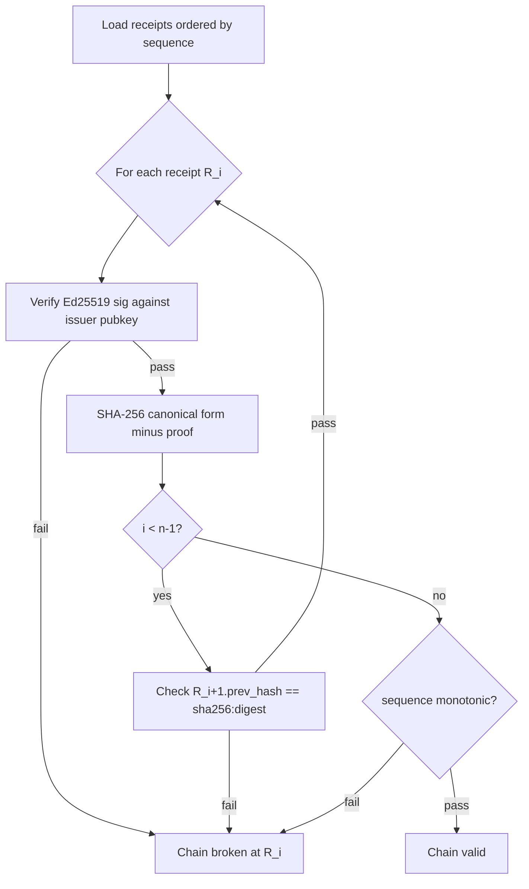
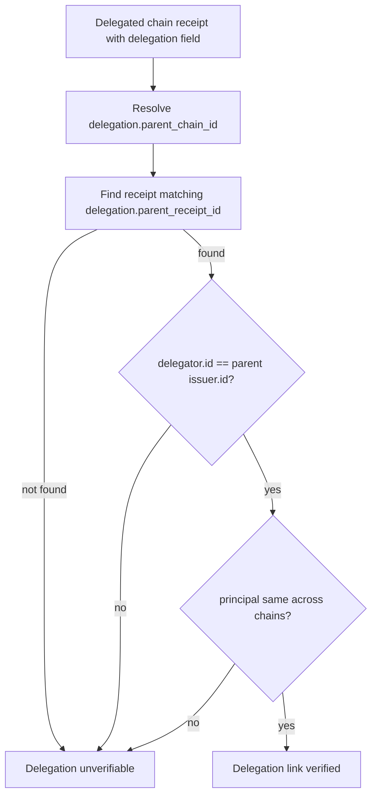
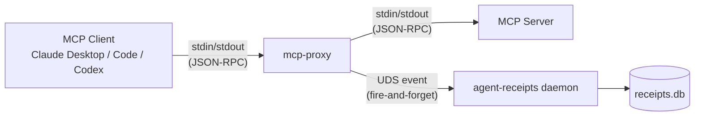
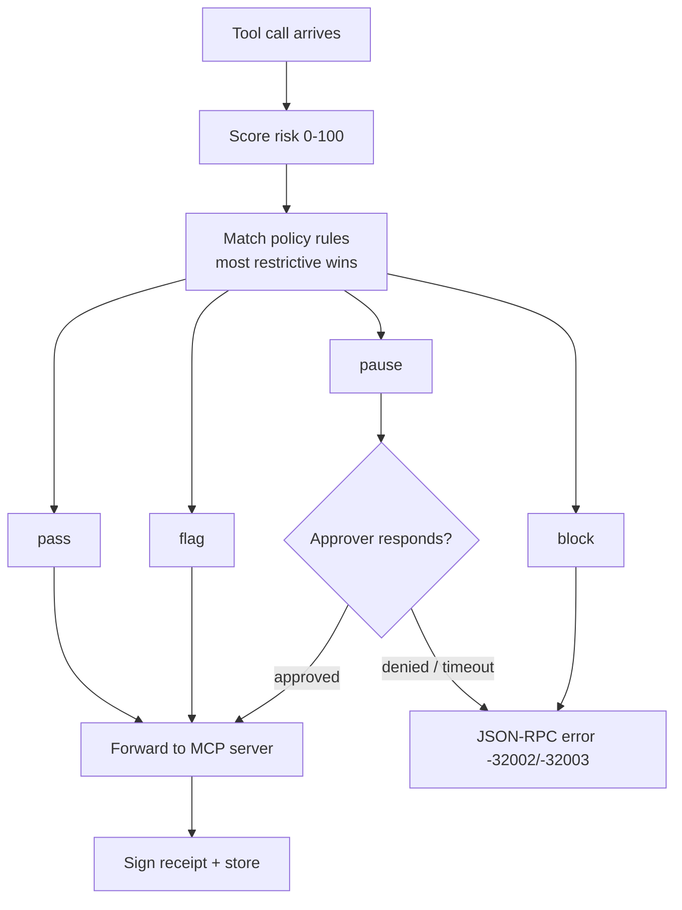
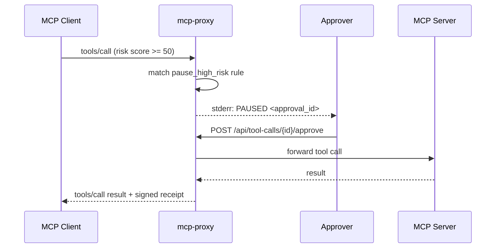
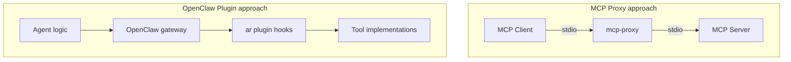
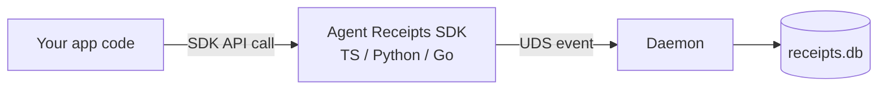
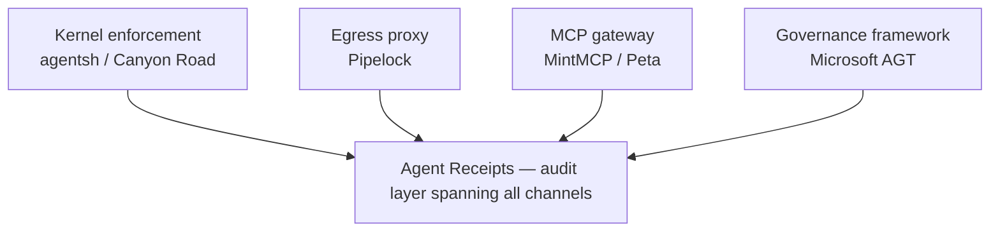

# Site Visuals Audit — Mermaid Diagram Opportunities

Audit date: 2026-04-30
Scope: `/home/user/ar/site/src/content/docs/` — mermaid diagrams only.

---

## Existing visuals (inventory)

| File | Visual | Notes |
|------|--------|-------|
| `index.mdx` lines 31–110 | SVG: 5-stage linear flow (Principal → Agent → Receipt → Chain → Verify) | In-process model only; no daemon/emitter split per ADR-0010 |
| `specification/how-it-works.mdx` lines 12–54 | SVG: receipt field map | Static field layout only; no process flow |
| `specification/how-it-works.mdx` lines 62–84 | SVG: signing pipeline (fields → RFC 8785 → Ed25519 → signed) | Missing who does each step; daemon split not shown |
| `specification/how-it-works.mdx` lines 97–121 | SVG: 3-receipt hash chain | Adequate for concept; no issues |
| `specification/how-it-works.mdx` lines 129–169 | SVG: delegation chain (Agent A → Agent B) | Adequate |
| `specification/overview.mdx` lines 30–78 | SVG: receipt field map (near-duplicate of how-it-works.mdx) | Redundant with how-it-works version |
| `specification/receipt-chain-verification.mdx` lines 8–47 | SVG: signing + chain linking | No verification steps shown; only the signing direction |
| `specification/agent-receipt-schema.mdx` lines 8–41 | SVG: field map (third copy) | Third near-identical copy of field layout |
| `blog/openclaw-plugin-deep-dive.mdx` lines 31–48 | Mermaid sequence: before/after_tool_call hooks | Only existing Mermaid; in-process signing model |

---

## Gap analysis by page

---

### 1. `site/src/content/docs/index.mdx` — Homepage

#### Gap 1.1 — Daemon/emitter component diagram (ADR-0010 architecture)

- **Type:** Component
- **Description:** Shows the emitter (plugin/proxy/SDK) as a thin fire-and-forget process communicating over a Unix domain socket to the daemon, which alone holds the signing key and SQLite database.
- **Location:** After the existing SVG flow at line 110; before the "What is an Agent Receipt?" section at line 117.
- **Priority:** HIGH — the architectural story ("signing keys live outside the agent") is the primary differentiator per `pitch.md` and is not depicted anywhere on the site.

#### Gap 1.2 — Homepage SVG is inconsistent with ADR-0010

- **Type:** N/A — existing diagram note
- **Description:** The SVG at lines 31–110 shows a single-process pipeline (Agent → Receipt → Chain) with no daemon boundary. This contradicts ADR-0010's architecture, which places signing and storage outside the agent. The diagram should be replaced or labelled as a conceptual overview only.
- **Location:** `index.mdx` lines 31–110 (existing SVG).
- **Priority:** HIGH — positions the product incorrectly against its core differentiator.

---

### 2. `site/src/content/docs/specification/how-it-works.mdx` — How It Works

#### Gap 2.1 — Tool-call-to-receipt sequence diagram

- **Type:** Sequence
- **Description:** Shows the full per-tool-call lifecycle — tool call arrives at emitter, event emitted over UDS, daemon receives it, captures peer creds, canonicalizes (RFC 8785), signs (Ed25519), chains (SHA-256 prev_hash), stores — ending with a signed receipt in SQLite.
- **Location:** After the signing SVG at line 84; before the "How receipts chain" section at line 95.
- **Priority:** HIGH — "How receipts are signed" prose describes the daemon's steps but no diagram shows the process flow or the trust boundary.

#### Gap 2.2 — Signing SVG does not show who holds the key

- **Type:** N/A — existing diagram note
- **Description:** The SVG at lines 62–84 shows "Receipt fields → RFC 8785 → Ed25519 sign → Signed Receipt" but gives no indication that signing happens exclusively in the daemon. Readers may assume signing happens in the calling process.
- **Location:** `how-it-works.mdx` lines 62–84 (existing SVG).
- **Priority:** MEDIUM — misleading when read without ADR-0010 context.

---

### 3. `site/src/content/docs/specification/receipt-chain-verification.mdx` — Chain Verification

#### Gap 3.1 — Verification flow diagram

- **Type:** Flowchart
- **Description:** Shows the verifier's algorithm: load chain from SQLite → for each receipt, verify Ed25519 sig → recompute SHA-256 of canonical form → confirm prev_hash matches → confirm sequence monotonic → pass/fail result with break-point identification.
- **Location:** After the intro SVG at line 47; before the "Canonical form" section at line 49.
- **Priority:** HIGH — the page describes a 4-step algorithm entirely in prose and numbered lists; a flowchart makes the decision points (fail fast vs. continue) immediately clear.

#### Gap 3.2 — Delegation verification flow

- **Type:** Flowchart
- **Description:** Walks the delegation verification steps: resolve parent_chain_id → locate parent_receipt_id → confirm delegator.id matches parent issuer → confirm principal unchanged across chains.
- **Location:** After the "Delegation verification" heading at line 86; before "Trusted timestamp verification" at line 96.
- **Priority:** MEDIUM — the 4-step delegation algorithm is prose-only; a flowchart makes the cross-chain lookup structure clear.

---

### 4. `site/src/content/docs/mcp-proxy/overview.mdx` — MCP Proxy Overview

#### Gap 4.1 — MCP proxy topology diagram (client/proxy/server/daemon)

- **Type:** Component
- **Description:** Shows the MCP client (Claude Desktop/Code/Codex) communicating over stdio to the mcp-proxy process, which forwards to the wrapped MCP server over a child process stdio, and emits audit events over UDS to the agent-receipts daemon.
- **Location:** After the ASCII art block at lines 33–46; before the "Quick start" section at line 50.
- **Priority:** HIGH — the current ASCII art (lines 33–46) shows only the Client → proxy → Server path; it omits the daemon entirely, making the architecture look in-process.

#### Gap 4.2 — Policy decision flowchart

- **Type:** Flowchart
- **Description:** Shows how a tool call moves through the policy engine: score risk → match rules (most restrictive wins) → pass / flag / pause (await approval or timeout) / block, with the resulting receipt outcome recorded at each branch.
- **Location:** In the "Features" section at line 17 or after the ASCII art at line 46; before "Quick start" at line 50.
- **Priority:** MEDIUM — the four actions (pass/flag/pause/block) and their precedence are explained in `configuration.mdx` in prose, but nowhere is the decision tree visualized for quick orientation.

---

### 5. `site/src/content/docs/mcp-proxy/approval-ui.mdx` — Approval Server

#### Gap 5.1 — Approval workflow sequence diagram

- **Type:** Sequence
- **Description:** Shows the full approval lifecycle: MCP client calls tool → proxy matches pause rule → proxy holds request and emits PAUSED to stderr → approver POSTs approve/deny → proxy forwards or rejects → client receives result.
- **Location:** After the "When the server runs" section at line 16; before the "Pin a predictable port" section at line 26.
- **Priority:** MEDIUM — the workflow is described in text across multiple sections; a sequence diagram makes the actors (MCP client, proxy, approver, MCP server) and their timing clear.

---

### 6. `site/src/content/docs/openclaw/overview.mdx` — OpenClaw Overview

#### Gap 6.1 — ASCII art hook pipeline lacks daemon context

- **Type:** N/A — existing content note
- **Description:** The ASCII art at lines 25–43 shows "OpenClaw agent → before_tool_call hook → Tool executes → after_tool_call hook → SQLite" with signing listed as an in-hook step. Under ADR-0010, signing moves to the daemon. The diagram will become outdated when v2 ships.
- **Location:** `openclaw/overview.mdx` lines 25–43.
- **Priority:** HIGH (once ADR-0010 is implemented) — currently accurate for v1 but contradicts the daemon architecture.

---

### 7. `site/src/content/docs/blog/openclaw-plugin-deep-dive.mdx` — OpenClaw Plugin Deep Dive

#### Gap 7.1 — Hook pipeline Mermaid is in-process only (ADR-0010 inconsistency)

- **Type:** N/A — existing Mermaid note
- **Description:** The Mermaid sequence at lines 31–48 shows `Plugin` doing "sign Ed25519 / hash + chain" in-process before storing to SQLite. Under ADR-0010 the plugin becomes a thin emitter and a separate daemon does all signing and storage. This is the only existing Mermaid on the site; it accurately depicts v1 but conflicts with the target architecture.
- **Location:** `blog/openclaw-plugin-deep-dive.mdx` lines 31–48.
- **Priority:** HIGH (once ADR-0010 ships) — should be updated when the plugin is cut to v2.

#### Gap 7.2 — Plugin vs. proxy topology comparison diagram

- **Type:** Component
- **Description:** Side-by-side or stacked diagram showing (a) MCP proxy placement: Client → proxy → MCP Server, and (b) OpenClaw plugin placement: inside the agent framework wrapping the tool dispatch layer — making the "where it sits" comparison in the prose table concrete.
- **Location:** After the comparison table at line 24; before the "The hook pipeline" section at line 27.
- **Priority:** MEDIUM — the prose table (lines 16–24) explains the placement difference but readers with no MCP/OpenClaw background cannot visualize it.

---

### 8. `site/src/content/docs/getting-started/quick-start.mdx` — Quick Start

#### Gap 8.1 — SDK integration topology

- **Type:** Component
- **Description:** Shows where a direct SDK integration sits in the stack: application code calls SDK functions, SDK emits events over UDS to the daemon (or in v1, signs in-process), distinguishing it from the proxy (wraps MCP server) and OpenClaw plugin (wraps framework hooks).
- **Location:** Before the TypeScript section at line 9; or after the "Next steps" section at line 126.
- **Priority:** LOW — quick start is code-first and the audience is already hands-on, but a single integration-modes diagram here would anchor the three paths (SDK / MCP proxy / OpenClaw plugin) for new readers.

---

### 9. `site/src/content/docs/ecosystem/index.mdx` — Ecosystem / Landscape

#### Gap 9.1 — Architectural layers diagram

- **Type:** Component
- **Description:** Visualizes the four layers of the agent security space (kernel enforcement, egress proxy, MCP gateway, governance framework) as a stack with Agent Receipts positioned as a horizontal audit layer spanning all of them.
- **Location:** After the "Executive Summary" table at line 16; before "Detailed Comparison" at line 22.
- **Priority:** LOW — the table already conveys the information; a diagram adds visual weight but is not essential for comprehension.

---

### 10. `site/src/content/docs/specification/overview.mdx` — Specification Overview

#### Gap 10.1 — Duplicate field map SVG

- **Type:** N/A — redundancy note
- **Description:** The SVG at lines 30–78 is nearly identical to the one at `how-it-works.mdx` lines 12–54 and `agent-receipt-schema.mdx` lines 8–41. All three show the same receipt field layout. Consider consolidating to one canonical instance.
- **Location:** `specification/overview.mdx` lines 30–78.
- **Priority:** LOW — not a missing diagram but a maintenance issue; three near-identical SVGs will drift out of sync.

---

## Priority summary

| Priority | Gap | File |
|----------|-----|------|
| HIGH | 1.1 Daemon/emitter component diagram | `index.mdx` |
| HIGH | 1.2 Homepage SVG inconsistent with ADR-0010 | `index.mdx` |
| HIGH | 2.1 Tool-call-to-receipt sequence | `specification/how-it-works.mdx` |
| HIGH | 3.1 Verification flowchart | `specification/receipt-chain-verification.mdx` |
| HIGH | 4.1 MCP proxy topology (client/proxy/server/daemon) | `mcp-proxy/overview.mdx` |
| HIGH | 6.1 OpenClaw ASCII art will conflict with ADR-0010 | `openclaw/overview.mdx` |
| HIGH | 7.1 Blog Mermaid is in-process only (ADR-0010 conflict) | `blog/openclaw-plugin-deep-dive.mdx` |
| MEDIUM | 2.2 Signing SVG hides who holds the key | `specification/how-it-works.mdx` |
| MEDIUM | 3.2 Delegation verification flowchart | `specification/receipt-chain-verification.mdx` |
| MEDIUM | 4.2 Policy decision flowchart | `mcp-proxy/overview.mdx` |
| MEDIUM | 5.1 Approval workflow sequence | `mcp-proxy/approval-ui.mdx` |
| MEDIUM | 7.2 Plugin vs. proxy topology comparison | `blog/openclaw-plugin-deep-dive.mdx` |
| LOW | 8.1 SDK integration topology | `getting-started/quick-start.mdx` |
| LOW | 9.1 Ecosystem architectural layers | `ecosystem/index.mdx` |
| LOW | 10.1 Duplicate field map SVGs (3 copies) | `specification/overview.mdx`, `how-it-works.mdx`, `agent-receipt-schema.mdx` |
