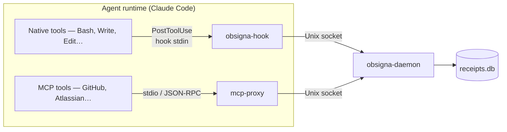

`mcp-proxy` covers MCP tool calls. `obsigna-hook` (formerly `agent-receipts-hook`, which still works as a deprecation shim — see [installation](/hook/installation/)) covers everything else: the native host tools that agent runtimes execute directly — `Bash`, `Write`, `Edit`, `Read`, `WebFetch`, and `WebSearch` in Claude Code, for example. Together they give the daemon a complete picture of agent activity across both channels.

## How it works

When an agent runtime invokes a native tool, it fires any configured `PostToolUse` hooks after the tool completes. `obsigna-hook` is wired up as one of those hooks. The runtime:

1. Serialises the tool name, input, and response as JSON
2. Spawns `obsigna-hook` with that JSON on stdin
3. Continues immediately — it does not wait for the hook to finish

The hook binary:

1. Reads and parses the stdin frame
2. Creates an `emitter.Event` with `channel: "claude-code"`, the tool name, input, output, and `decision: "allowed"` (PostToolUse fires only after the tool ran)
3. Forwards the event to the daemon over a Unix socket
4. Exits 0 on success

The hook does not pause or modify the tool call. If the stdin frame is unreadable or the calling runtime isn't recognised, it exits 0 silently — the event isn't ours to record. But once the runtime **is** identified, a failure to record the receipt (daemon not running, socket missing, malformed or oversized frame) exits 1 with a message on stderr. This is deliberate: a broken audit pipeline is surfaced to the runtime rather than silently dropping receipts, the same surface-don't-drop stance as the SDK [emit-failure contract](https://github.com/agent-receipts/obsigna/blob/main/docs/adr/0025-emit-failure-contract.md).

## Difference from mcp-proxy

| | mcp-proxy | obsigna-hook |
|---|---|---|
| **What it covers** | MCP tool calls (`tools/call` JSON-RPC) | Native host tool calls |
| **Deployment** | Long-running subprocess per MCP server | Short-lived process per tool call |
| **Supported clients** | Any MCP client (Claude Code, Claude Desktop, Codex…) | Clients that support post-tool-use hooks |
| **Policy enforcement** | Yes — pass, flag, pause, block | No — hook fires after the tool ran |
| **Local receipt signing** | Yes — in-proxy Ed25519 | No — daemon signs |
| **Taxonomy** | MCP server tool names | Native tool names (`Bash`, `Write`, …) |

Both channels write to the same `obsigna-daemon` receipt chain, identified by a shared session ID.

## MCP tool overlap

Claude Code tools with the `mcp__*` prefix are already captured by `mcp-proxy`. By default, `obsigna-hook` is registered with an empty matcher, which means it also receives `mcp__*` PostToolUse events. This produces a second receipt for each MCP tool call — one from the proxy, one from the hook. The two receipts are distinguishable: the proxy receipt has `channel: "mcp"` and the hook receipt has `channel: "claude-code"`.

Whether this overlap is desirable depends on your use case. A future release will add a matcher-based option to exclude `mcp__*` tools from the hook. For now, the duplicate provides a cross-check: if the proxy and hook disagree on a tool call result, it is a signal worth investigating.

## Session correlation

Claude Code passes the current session ID in the `session_id` field of every hook frame. The hook forwards it to the daemon via `WithSessionID`, so all receipts within a session — from both `mcp-proxy` and `obsigna-hook` — carry the same session identifier and are grouped together when querying.
