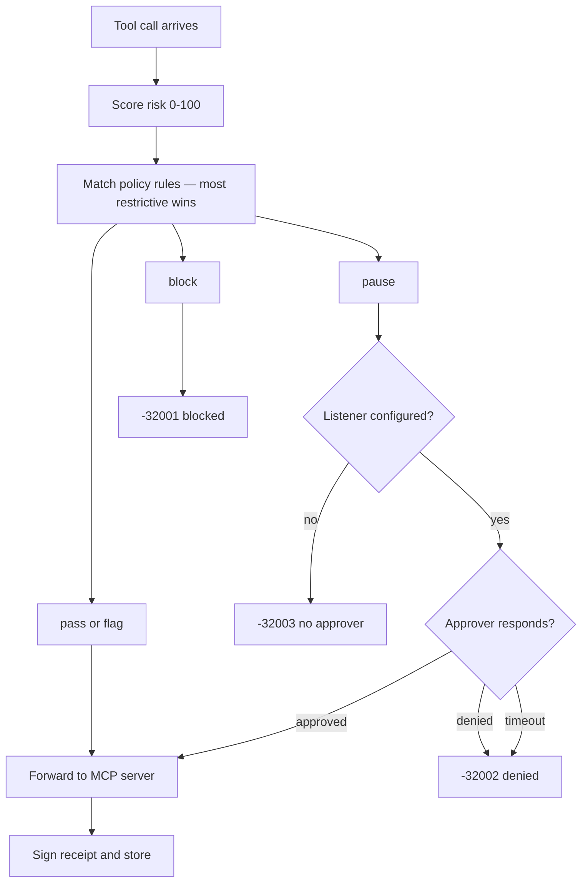
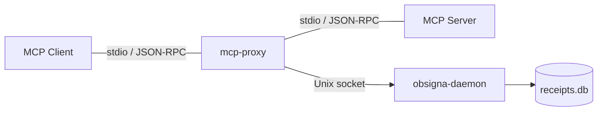

The MCP Proxy is a transparent stdin/stdout proxy that sits between an MCP client (Claude Desktop, Claude Code, etc.) and any MCP server. It intercepts every tool call, classifies and scores it, and applies proxy-layer policy rules — then forwards the completed event to `obsigna-daemon` over a Unix socket. The daemon redacts sensitive data, signs an Ed25519 receipt, hash-chains it, and persists it. The proxy holds no key and no store of its own ([ADR-0010](https://github.com/agent-receipts/ar/blob/main/docs/adr/0010-daemon-process-separation.md)) — so a compromised proxy cannot rewrite the chain. It does this without modifying the server or client.

**Repository:** [`mcp-proxy/`](https://github.com/agent-receipts/ar/tree/main/mcp-proxy)

:::note[The default policy includes a `pause_high_risk` rule — approvals are opt-in]
The built-in policy contains a `pause_high_risk` rule (`min_risk_score: 50`). The approval listener is **off by default**, so a paused call fails fast with a clear error (JSON-RPC code `-32003`, message `no approver configured…`) rather than timing out. To approve high-risk calls interactively instead, see [Approval Server](/mcp-proxy/approval-ui/).

Scores that cross 50: `create_token` (write 20 + sensitive 30 = 50), `update_auth_config` (70), `delete_credential` (70), `exec_sql` with `DELETE …` and no `WHERE` (60). Scores that don't: plain writes like `create_pull_request` (20), plain deletes like `delete_branch` (40), sensitive-keyword reads like `get_token` (30). Seeing `-32002` on tools that *shouldn't* pause is usually client-side denial — see [troubleshooting](/mcp-proxy/configuration/#-32002-errors-on-tool-calls).
:::

## Features

- **Risk scoring** -- scores every tool call 0-100 based on operation type, sensitive keywords, and patterns
- **Operation classification** -- classifies calls as read, write, delete, or execute by tool name
- **Action taxonomy** -- daemon stores action types as `<channel>.<server>.<tool>`; full taxonomy remapping to canonical types like `data.api.read` is tracked for a future release
- **MCP prefix stripping** -- automatically strips `mcp__<server>__` prefixes so receipts and classification use clean tool names
- **Policy rules** (proxy layer) -- YAML rules engine with four actions: pass, flag, pause (approval required), and block
- **Approval workflows** (proxy layer) -- HTTP endpoints for async approval of paused operations
- **Cryptographic receipts** -- the daemon signs each forwarded event as an Ed25519 W3C Verifiable Credential and hash-chains it; the proxy itself never holds the key
- **Issuer identity** -- receipts identify the AI agent, model, and operator via CLI flags
- **Intent tracking** -- groups related tool calls by temporal proximity
- **Data redaction** (daemon) -- JSON-aware and pattern-based redaction of secrets before storage
- **Audit CLI** -- list, show, and verify receipts with the [`obsigna`](/reference/cli-commands/#obsigna) CLI



## How it works

```
MCP Client (Claude Desktop / Claude Code)
    |
    v
 mcp-proxy (stdin/stdout)
    |  - classify operation
    |  - score risk
    |  - evaluate policy rules
    |  - forward event (--socket) ─────────────> obsigna-daemon
    v                                                 - redact sensitive data
 MCP Server (any)                                     - sign receipt (Ed25519)
                                                      - hash-chain + persist
```

The proxy reads JSON-RPC messages on stdin, processes `tools/call` requests, forwards them to the wrapped server, and returns the response. Each completed tool call is emitted to `obsigna-daemon` over `--socket`, which signs it into the receipt chain. Start the daemon before the proxy — see [Daemon Setup](/getting-started/daemon-setup/).



## Quick start

```bash
# Install (Homebrew, macOS/Linux)
brew install agent-receipts/tap/obsigna
# …or from source: go install github.com/agent-receipts/ar/mcp-proxy/cmd/mcp-proxy@latest

# Wrap any MCP server (example: the filesystem server via npx)
mcp-proxy npx -y @modelcontextprotocol/server-filesystem ~/Documents

# With configuration (example: GitHub's official MCP server — brew install github-mcp-server)
# Receipts are signed and stored by obsigna-daemon — start it first (see Daemon Setup).
mcp-proxy \
  -name github \
  -rules rules.yaml \
  -issuer-name "Claude Code" \
  github-mcp-server stdio
```

To enable the approval workflow, pass `-http 127.0.0.1:<port>` — see [Approval Server](/mcp-proxy/approval-ui/).

## Claude Desktop integration

Add to `~/Library/Application Support/Claude/claude_desktop_config.json` (macOS). Claude Desktop doesn't expand `${VAR}` in `env` blocks, so wrap the proxy in a secret manager (`op run`, `aws-vault exec`, …) — the snippet below uses 1Password CLI, with the token resolved from `op://` at exec time and never written to disk:

```json
{
  "mcpServers": {
    "github-audited": {
      "command": "/opt/homebrew/bin/op",
      "args": [
        "run",
        "--env-file=/Users/YOU/.local/share/agent-receipts/mcp.env",
        "--",
        "/Users/YOU/go/bin/mcp-proxy",
        "-name", "github",
        "-issuer-name", "Claude Desktop",
        "-operator-id", "did:web:anthropic.com",
        "-operator-name", "Anthropic",
        "/opt/homebrew/bin/github-mcp-server", "stdio"
      ]
    }
  }
}
```

`mcp.env` references the secret by path (`GITHUB_PERSONAL_ACCESS_TOKEN=op://Personal/GitHub/token`); see the [Claude Desktop integration guide](/mcp-proxy/claude-desktop/#configure-claude_desktop_configjson) for the OS-keychain-launcher fallback and other patterns.

## Claude Code integration

Claude Code uses `claude mcp add-json` to register servers. Use `--scope user` to make the proxy available across all projects:

```bash
claude mcp add-json github-audited --scope user '{
  "command": "/Users/YOU/go/bin/mcp-proxy",
  "args": [
    "-name", "github",
    "-issuer-name", "Claude Code",
    "-operator-id", "did:web:anthropic.com",
    "-operator-name", "Anthropic",
    "/opt/homebrew/bin/github-mcp-server", "stdio"
  ],
  "env": {
    "GITHUB_PERSONAL_ACCESS_TOKEN": "${GITHUB_PERSONAL_ACCESS_TOKEN}"
  }
}'
```

Verify registration:

```bash
claude mcp list
```

See the [Claude Code integration guide](/mcp-proxy/claude-code/) for a full walkthrough including project-scoped setup and `.mcp.json` configuration.

:::tip
Running multiple MCP clients simultaneously with the approval listener enabled? See [Troubleshooting: port conflicts](/mcp-proxy/configuration/#multiple-mcp-clients-running-the-proxy-simultaneously) in the configuration guide.
:::

## What receipts look like

Each tool call produces a signed W3C Verifiable Credential. Key fields shown (abbreviated — full receipts include `@context`, `id`, `type`, `issuanceDate`, and `proof`):

```json
{
  "issuer": {
    "id": "did:agent-receipts-daemon:local",
    "name": "Claude Code",
    "operator": {
      "id": "did:web:anthropic.com",
      "name": "Anthropic"
    }
  },
  "credentialSubject": {
    "principal": { "id": "did:user:otto" },
    "action": {
      "type": "data.api.read",
      "tool_name": "get_issue",
      "risk_level": "low",
      "target": { "system": "github" }
    },
    "outcome": { "status": "success" },
    "chain": {
      "sequence": 1,
      "previous_receipt_hash": null,
      "chain_id": "9351bc33-..."
    }
  }
}
```

Receipts are Ed25519-signed by the daemon, hash-chained, and stored in a local SQLite database. Use `obsigna receipt list`, `obsigna receipt show`, and `obsigna receipt verify` to query and validate them.

`obsigna receipt list` gives a compact tabular view of the daemon's store. When you proxy multiple MCP servers — for example GitHub and Atlassian — the TOOL column lets you scan activity across all of them at once:

```
$ obsigna receipt list
SEQ  TIMESTAMP             CHAIN       TOOL / ACTION TYPE
6    2026-04-24T02:05:19Z  2026-04-24  getJiraIssue
5    2026-04-24T01:58:45Z  2026-04-24  issue_write
4    2026-04-24T01:56:12Z  2026-04-24  searchJiraIssuesUsingJql
3    2026-04-24T01:56:06Z  2026-04-24  getAccessibleAtlassianResources
2    2026-04-24T01:48:55Z  2026-04-24  issue_write
1    2026-04-24T01:45:07Z  2026-04-24  list_issues
```

See [Installation](/mcp-proxy/installation/) to get started, or [Configuration](/mcp-proxy/configuration/) for the full set of options.
