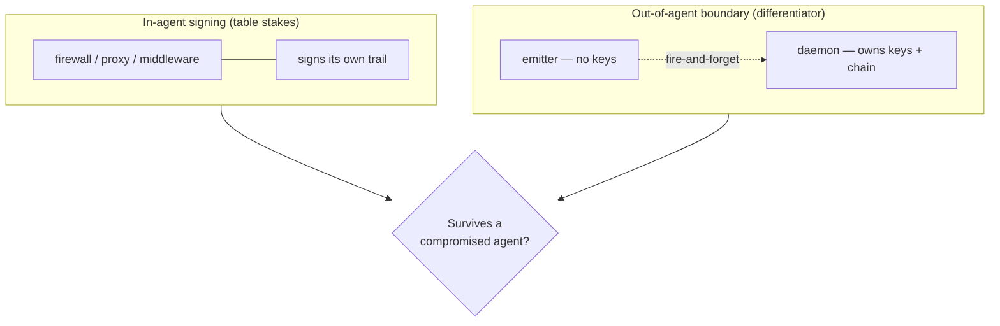

_Published 2026-05-23_

This is our dated read of the agent security space as of May 2026 — what we think, and when. For the always-current matrices, see the [living landscape](/ecosystem/landscape/). The previous snapshot is [April 2026](/blog/agent-security-tooling-landscape-april-2026/).

## Executive Summary

A month ago the space was segmenting by enforcement mechanism — kernel, egress, MCP proxy, application middleware, gateway. That segmentation still holds, but the centre of gravity moved. The story in May is **provenance**: who can prove what an agent did, in a form a third party will accept.

Two shifts drove this:

1. **Receipts went from differentiator to table stakes.** In April, a signed audit trail was something Agent Receipts and a handful of firewalls did. In May, signed, hash-chained, often W3C-VC-shaped receipts show up across the audit-first entrants (Asqav, nono), in Pipelock's EvidenceReceipt v2 standardization play, and in Microsoft AGT's compliance pipeline. Emitting a signed receipt is no longer the thing that sets a project apart.

2. **The durable differentiator is the trust boundary, not the receipt format.** If the process that signs the audit trail is the same process being audited, the signature proves the bytes weren't altered in transit — not that the auditor recorded honestly. The property that survives a compromised agent is *where the signing key lives*. Agent Receipts' answer is the [out-of-agent boundary](/blog/daemon-process-separation/): keys and chain live in `agent-receipts-daemon`, a separate OS user the agent process can't reach. That, paired with the portable [W3C Verifiable Credential envelope](/specification/overview/), is what we're positioning on — not "we also sign receipts."

   We are not alone on this axis. **nono** keeps its append-only Merkle log where the agent can't reach it and anchors provenance through Sigstore/Rekor — the same out-of-agent bet, by a different mechanism. So the boundary alone isn't the moat; the differentiation narrows to the **portable W3C VC envelope** and **one chain across every channel** (MCP, hook, HTTP) rather than a per-tool log.

## What changed since April

### Microsoft AGT is the distribution wildcard

Microsoft's **Agent Governance Toolkit** (v3.0 Public Preview) now ships first-class **Agent Framework** integration — governance moves from an opt-in middleware install to something wired into the framework agents are already built on. AGT's reach (five language SDKs, 12+ framework adapters, EU AI Act / NIST / SOC 2 mappings) was already the broadest in the space; bundling it with the framework changes the default. The architectural caveat from April is unchanged: AGT signs **in-process**, same trust boundary as the agent. Distribution scale doesn't move the audit boundary — but it does set the baseline everyone is now measured against.

### An audit & provenance layer is forming

April's four-layer model (gateways, firewalls, kernel, governance frameworks) missed a category that crystallized in May: tools whose primary product *is* the provenance record, not enforcement. The direct, audit-first entrants are **Asqav**, **nono**, and **InALign**.

| | Primary product | Signing locus | Envelope | Notes |
|---|---|---|---|---|
| **Agent Receipts** | Provenance record | **Out-of-agent daemon** | W3C VC (Ed25519, RFC 8785) | Keys + chain outside the audited process; one chain across all channels |
| **nono** | Provenance record | **Out-of-process** (append-only Merkle log) | Sigstore/Rekor anchored | Closest on the boundary axis; binary-identity binding |
| **Asqav** | Provenance record | In-agent / SDK | Signed records (ML-DSA-65, RFC 3161 timestamps) | Audit-first; post-quantum signing, EU AI Act audit packs |
| **InALign** | Alignment + audit | In-process | SHA-256 hash chain | MCP-native; MITRE-mapped detection, EU AI Act checks |

The point of the table isn't a feature scorecard — several of these are days-to-weeks old. The point is the axis that separates them: **does the audit layer sit inside or outside the agent's trust boundary, and is the record portable across verifiers?** Note that we and nono land on the same side of the first question; the W3C VC envelope and single cross-channel chain are where we differ. That axis is where we expect the next year of competition to play out.

A related but distinct effort is **CAP-SRP** (VeritasChain) — a *refusal*-provenance spec that proves an AI declined harmful content. It's adjacent to this layer, not a general agent-action audit format, so it solves a different problem than the cross-channel agent record.

### Pipelock's standardization play

Pipelock's **EvidenceReceipt v2** is a bid to standardize the receipt format itself — moving from "our firewall emits an audit record" toward "here is the record format the ecosystem should adopt." It's the clearest signal that the format layer is consolidating. Format standardization is good for the space and good for us: a portable record is only valuable if more than one tool emits and reads it. The question a standard has to answer is the same boundary question — a standard receipt signed in-process still can't outlive a compromised signer.

## The standards window

The backdrop is **EU AI Act Article 12**, which requires automatic, tamper-evident logging of high-risk AI system operation over its lifetime — almost verbatim the problem a hash-chained, independently-signed receipt solves. **August 2, 2026** is a genuine AI Act milestone, though it's worth noting that some Annex III high-risk obligations were reportedly deferred (to late 2027) in a recent political agreement, so the hard deadline is softer than a single date implies. The direction of travel is what matters: tamper-evident logging is becoming a legal expectation, not a nice-to-have.

A few standards efforts are positioning into that space:

- **Pipelock EvidenceReceipt v2** — the format play described above; the most concrete shipping artifact.
- **W3C Verifiable Credentials Data Integrity** — the (already-Recommendation) envelope our receipts use; the CG is where canonicalization questions (JSON-LD vs. RFC 8785) get argued.
- **IETF draft-sharif** — `draft-sharif-agent-audit-trail`, an individual Internet-Draft (not yet WG-adopted) toward a logging format for agent actions. Early, but a signal that the format question has reached the IETF.

(General supply-chain transparency work — IETF SCITT, COSE receipts — is the substrate some of these build on, but it's not agent-audit-specific and we don't count it as part of this race.)

These reviewers read the public landscape to understand how each project positions itself. Our position has to be legible before those conversations harden: the receipt is a W3C VC; the differentiator is the out-of-agent boundary; the format should be portable and we'll align with a credible standard rather than fork one. Publishing this read *is* the standards-room prerequisite, not an afterthought.

## Where v0.3.0 fits

The [v0.3.0 spec](/specification/agent-receipt-schema/) (2026-05-21) makes the boundary concrete in the wire format. Two additions came directly out of the daemon split:

- **`peer_credential`** — OS-attested process metadata (pid, uid, gid, exe_path) the daemon captures from the kernel at the socket, not from the emitter's self-report. The connecting process can lie about its payload; it can't lie about who it is.
- **`emitter_metadata`** — daemon-observed `drop_count` on synthetic `events_dropped` receipts, so a gap in the trail is itself recorded in the chain.

Both fields are *daemon-attested, not agent-claimed*. That distinction — encoded in the schema, not just the implementation — is the out-of-agent boundary expressed as protocol. The credential type also became `AgentReceipt` (from `AIActionReceipt`), aligning the spec name with the project.

## The read in one paragraph

Signed receipts are now baseline; the audit-first layer (Asqav, nono, InALign) has receipts too. What differentiates is whether the audit survives a compromised agent — which comes down to where the signing key lives — and whether the record is portable enough for a third party to verify. nono shares the out-of-agent stance; Agent Receipts' bet is that plus the portable W3C VC envelope and one chain across every channel, and the unfolding standards positioning (VC Data Integrity, the EvidenceReceipt and draft-sharif format plays) is where that bet gets tested. Full matrices, kept current, live in the [landscape document](/ecosystem/landscape/).
