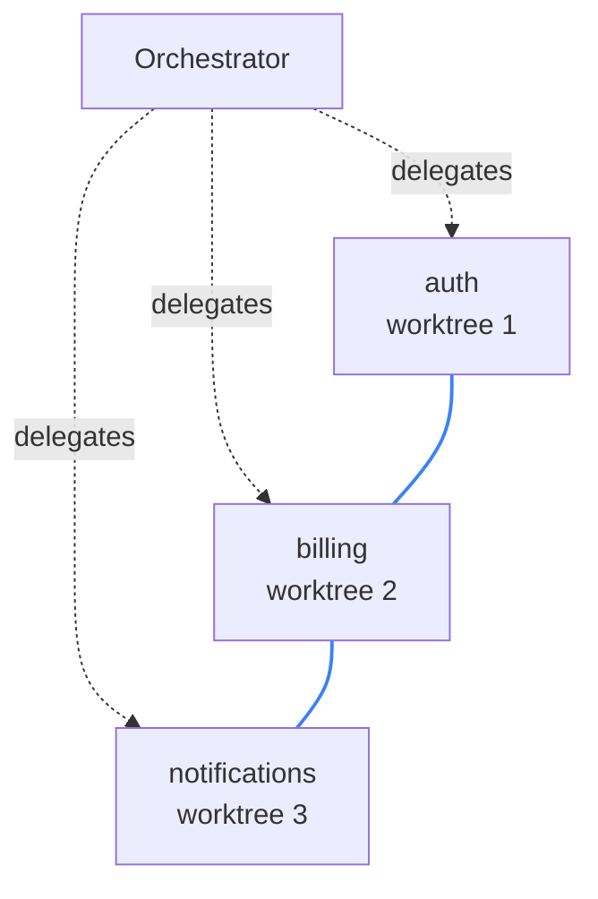

_Published 2026-06-14_

{/* TODO before publish:
  - Hero: /blog/vault-swarm-graph.png = clean fresh-session capture (session f89f8994, orchestrator + the 3 vault agents a048ee95 / aa82f880 / a4984f21, blue contention edges). JSON synced to that run (auth agent a048ee9547c58c4ae).
  - Canonical home: currently agentreceipts.ai; per plan this is a tooling post for the obsigna.dev blog (would flip canonical + index). Slug stays attribution-over-undo unless we rename.
  - Follow-up issues (out of scope): (1) shell commands get default `medium` risk + no target.resource — classify rm/mv/cp; (2) draw resource edges for non-file resources (API endpoints, DB tables) so shared-API contention shows like shared-file contention; (3) failed tool calls (e.g. a losing concurrent Edit) aren't receipted — a lost write currently leaves no failure row, only the retry reads.
  Remove this comment before publish. */}

---

Three agents ran the deploy below, each in its own isolated worktree. None could see the others' files; none knew the others existed. All three wrote to the same secret store — because the secret store wasn't in any of their worktrees. The receipt chain ties them together through it.


That's the gap this post is about. Sandboxing an agent fences its working tree; it does nothing for the database row, the API, the secret it rotates, the thing it deploys. The moment two agents reach past the sandbox to the same shared resource, isolation goes quiet — and the only record that both touched it, and who they were, is the receipt.

---

## Isolation and reversal both stop at the repo

The two standard answers to "what if an agent does something bad" are **isolation** and **reversal**, and both are good — inside their boundary.

Isolation gives each agent its own git worktree or sandbox, so they can't step on each other's files. Reversal snapshots the filesystem before a turn and restores it after, so a botched edit is gone. [nono](https://github.com/nono-sh/nono) does the reversal case properly — a host-level sandbox plus content-addressed snapshots and atomic restore — and worktrees handle isolation well enough that file collisions inside a repo are mostly a solved problem. Credit where it's due: for the local filesystem, this is covered.

But both draw the same boundary, and it's the repo. A worktree fences the working tree. A snapshot restores the working tree. Neither has anything to say about the rest of the world — the secret store every service reads from, the config two agents both edit, the database row they both update, the API they both call, the deploy one of them triggers. None of that lives in a worktree, and no snapshot un-sends it.

And reaching past the sandbox is the normal case, not the exception — agents are *supposed* to call APIs and write to shared stores. So the question was never how to prevent or undo those actions. It's how to know, afterward, which agent did what to the shared thing — and under whose authority.

---

## The part that's actually new

When a swarm converges on shared state, you need three answers:

- **Which** agent did this, out of the swarm?
- **Under whose authority** — which principal, which mandate?
- **What else touched the same thing** — which other agents, in what order, with what dependency between them?

The first two are table stakes. Any signed receipt attributes an action to an actor; that stopped being a differentiator a while ago. The third is the hard one, and it's the new capability: reconstructing, from separately-signed per-agent records, the graph of **which agents touched which shared resources and how their actions relate**. A single-actor sandbox can't produce it — it sees one process. A flat audit log can't either — no cross-agent linking. You need per-agent chains plus a resource index, and something outside the agents signing each record as it happens.

---

## The receipts are real

The deploy up top isn't a mockup. An orchestrator delegated to three agents, each in its own worktree, each provisioning one service's credential into the shared vault:



Each agent ran on its own hash-chained sequence, keyed `<session>/agent/<agent-id>`, linked back to the orchestrator by a `delegation` edge. Here's a real receipt — the auth agent writing to the vault, abbreviated:

```json
{
  "issuer": {
    "id": "did:agent-receipts-daemon:local",
    "session_id": "f89f8994-d8dc-4ba8-85d1-71b4a8442751",
    "runtime": { "agent_id": "a048ee9547c58c4ae", "agent_type": "general-purpose" }
  },
  "credentialSubject": {
    "principal": { "id": "did:user:ottojongerius" },
    "action": {
      "type": "claude-code.Edit",
      "target": { "system": "filesystem", "resource": ".../vault-demo/credentials.yaml" },
      "peer_credential": { "platform": "darwin", "uid": 501, "gid": 20 }
    },
    "chain": { "sequence": 2, "chain_id": "2026-06-03-12/agent/a048ee9547c58c4ae" }
  }
}
```

That one record answers all three questions, each anchored to something the agent couldn't forge:

- **Which agent** — `issuer.runtime.agent_id`: which of the three did it.
- **Under whose authority** — `principal.id` is `did:user:ottojongerius`, resolved from `peer_credential.uid: 501`, the OS user the kernel reported at the socket (`LOCAL_PEERCRED`). The agent has no hand in setting it; the raw uid stays in the record as the verifiable backing.
- **What signed it** — `issuer.id` is the daemon, running as its own OS user the agents can't reach (the [out-of-agent boundary](/blog/daemon-process-separation/)).

Group every receipt by `action.target.resource` and the contention falls out: three agents, three isolated worktrees, one shared file. It wasn't hypothetical — two of them wrote cleanly, but the third's chain runs longer, re-reading the vault several times before its write landed, because the file kept shifting under it as the others wrote. The dashboard draws an edge between agents that touched the same resource, so the three show up tied together through the vault — even though nothing in their working trees ever overlapped. That edge is the thing a sandbox can't see and a snapshot can't represent.

---

## Honest by construction

What makes this trustworthy rather than just slick is that the view declares where it can't see.

The edges are drawn from `action.target.resource`, and that field is populated where the runtime hands us structure — native `Read`/`Write`/`Edit` carry a file path, so a shared **file** like the vault draws edges today. A purely external resource — a database table, an API endpoint — is captured in the receipt but doesn't yet carry a structured resource, so two agents hitting the same API won't draw an edge *yet*. The dashboard says so: it surfaces a coverage fraction, the share of receipts that actually carry a resource, precisely so the graph never implies a completeness it doesn't have.

The same gap shows up in shell commands. An `rm` is recorded as `claude-code.Bash` with no `action.target` and a default `medium` risk — the same as a harmless `echo`. To the pipeline it's just a shell call; what it did is hidden inside it. But it isn't lost: the command and its intent live in the receipt's HPKE-encrypted disclosure, recoverable with the forensic key. Structured where the runtime gives structure, sealed-but-recoverable where it doesn't — and the view tells you which is which.

There's one more honest edge, on authority. The principal is the **OS user**, kernel-attested — a real answer to *who*. What it isn't yet is the **mandate**: which delegated grant let this agent reach the vault, and whether reverting its write would exceed that grant. The schema reserves the slots (`authorization.scopes`, `authorization.grant_ref`); nothing populates them today, so the receipts give you an attested principal and, for now, an empty mandate, surfaced plainly. Mandate is the next layer up, building on the attested principal floor.

---

## Where reversal fits

Reversal doesn't disappear; it changes altitude. Because attribution is primary, undo becomes an **attributed action you offer where the graph permits** — the engine computes the blast radius, a policy gate approves or flags it, and the reversal is itself a signed receipt linked by `reversal_of` into the same chain. The undo is auditable, attributable, and mandate-scoped. A standalone snapshot tool has none of that. Reversal becomes the thin tier beneath attribution.

---

## The split this makes concrete

This is also why the project now has two names. The **signed, chained, attributed record** is the protocol — Agent Receipts. Everything that produces and reads that record is the toolset, Obsigna: the PostToolUse **hook** that emitted every action in this session, the **daemon** that signs and hash-chains them out of the agents' reach, and the **CLI** and **dashboard** that read them back. The graph up top is the dashboard rendering an Agent Receipts chain — and you could write a different reader against the same receipts and get the same answers, because the answers live in the record itself.

Your agents can be perfectly isolated and still converge on the same secret, the same row, the same deploy. Isolation won't tell you they did. The record will — which agents, under whose authority, against what they shared.
