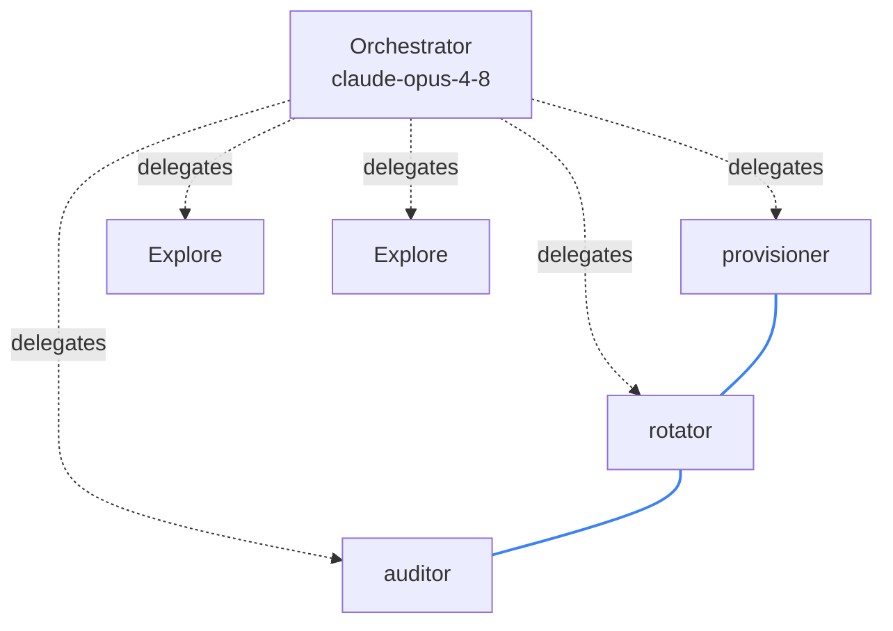

_Published 2026-06-14_

{/* TODO before publish:
  - Canonical home: currently set to agentreceipts.ai; per plan this is a tooling post for the obsigna.dev blog, which would flip the canonical URL + index entry.
  - Post is wired into the blog index (site/src/content/docs/blog/index.mdx).
  - Screenshots: hero = /blog/blast-radius-node-detail.png (contention graph; shows no principal, so no conflict with the now-known username). mermaid/table are role-only so no agent-id cross-reference to the hero. §4 receipt JSON uses a real released receipt (agent a8fb7a…, did:user:ottojongerius). OPTIONAL polish: capture a fresh receipt-detail card on the live v0.26.0 daemon showing did:user:ottojongerius (a "known principal" visual), and/or a fresh graph from a clean session.
  - Follow-up issue (out of scope for this post): shell commands get a default `medium` risk (rm == echo) and no target.resource — teach the hook/daemon to classify rm/mv/cp.
  Remove this comment before publish. */}

---

Five agents ran in the session below, and three of them reached for the same file — the last of them deleted it. The receipt chain pins down which three, and who did what: every edge in the graph is drawn from a signature a separate process wrote as the call happened.


That blue edge is the main point of this post. Two of those agents — the unconnected ones on the right — were off reading unrelated files. The three on the left all reached for `config/credentials.yaml`. One created it, one rotated a key in it, one deleted it. The graph draws the contention because the receipts carry it.

The intuitive thing to want here is **undo**. "Show me what the swarm did, then let me roll it back." We chased that for a while. It's the wrong primary.

---

## Undo is a trap

The instinct is per-action undo: reverse the auditor's delete, keep everyone else's work. In a real session that rarely stays clean — renames, restructures, a file rewritten three times in a turn — so fine-grained undo degrades into compensation with merge conflicts, and you fall back to **checkpoint restore**: snapshot the filesystem before the turn, atomically restore it after.

For the filesystem, that works, and it's already well-handled. [nono](https://github.com/nono-sh/nono) does it properly — a host-level sandbox plus content-addressed snapshots, Merkle-root integrity, atomic restore — and it's real protection against an agent trashing your working tree. Reversal-of-files is a solved capability; that's a compliment, and it's why it isn't where the hard problem lives.

The harder problem is that a large class of agent actions can't be snapshotted at all. The agent sends an email, charges a card, triggers a deploy, calls another service's API. Restoring your local files doesn't un-send the request — and those calls are usually *supposed* to happen, so sandboxing them away breaks the agent instead of protecting you. Once a side effect has left the machine, neither rollback nor prevention helps. The only handle left is the attributed record: what went out, which agent sent it, under whose authority.

So reversal is the right tool for one slice of the problem, and a good one. What spans the rest is attribution.

---

## The question that actually matters

When a swarm touches your filesystem, what you need to answer is:

- **Which** agent did this, out of the N that were running?
- **Under whose authority** — which human principal, which delegated mandate?
- **What else breaks** if I touch this one thing — what did the same agents do to related files in the same turn?

That's **attribution and blast radius**, and it is structurally not something a snapshot tool can answer. A host-level snapshot sees one process making changes. The receipt chain sees N agents under M principals, each action signed, ordered, and attributed. A snapshot can roll your files back; it can't tell you who did what or why, and it can't tell you what else moves if you pull a thread.

That information only exists if something recorded it — signed, outside the agents, at the moment each action happened.

---

## The receipts are real

The session above isn't a mockup. It's an orchestrator (`claude-opus-4-8`) that delegated to five subagents. Three of them were told to contend on one scratch file:



Each subagent ran on its own hash-chained sequence, keyed `<session-chain>/agent/<agent-id>`, with the first receipt on each chain carrying a `delegation` link back to the orchestrator's chain. Here's a real one — the auditor editing the shared file, abbreviated:

```json
{
  "issuer": {
    "id": "did:agent-receipts-daemon:local",
    "session_id": "1c665a44-2706-4f71-a478-c32654526eb5",
    "runtime": { "agent_id": "a8fb7a111017ff997", "agent_type": "general-purpose" }
  },
  "credentialSubject": {
    "principal": { "id": "did:user:ottojongerius" },
    "action": {
      "type": "claude-code.Edit",
      "target": { "system": "filesystem", "resource": ".../config/credentials.yaml" },
      "peer_credential": { "platform": "darwin", "uid": 501, "gid": 20 }
    },
    "chain": { "sequence": 2, "chain_id": "2026-06-03-10/agent/a8fb7a111017ff997" }
  }
}
```

That one record answers all three questions, each anchored to something the agent couldn't forge:

- **Which agent** — `issuer.runtime.agent_id`: which of the five subagents acted.
- **Under whose authority** — `principal.id` is `did:user:ottojongerius`, resolved from `peer_credential.uid: 501` — the OS user the kernel reported at the socket (`LOCAL_PEERCRED`). The name is the daemon's lookup of a kernel-attested uid — the agent has no hand in setting it — and the raw uid stays in the record as the verifiable backing.
- **What signed it** — `issuer.id` is the daemon, running as its own OS user the agents can't reach (the [out-of-agent boundary](/blog/daemon-process-separation/)).

Signer, actor, and principal are three distinct identities in one signed object, and the two that carry attribution are both attested by the kernel. No agent vouches for itself.

Group those receipts by `action.target.resource` and the contention falls out:

| Resource | provisioner | rotator | auditor |
|---|---|---|---|
| `config/credentials.yaml` | `Write` (create) | `Read`, `Edit ×2` | `Read`, `Edit`, `Bash` (rm) |

Three distinct agents, one file identity. Click the auditor node and the dashboard shows its blast radius directly — a state-dependency edge back to the rotator's chain via `…/config/credentials.yaml`: the rotator handed it the file. The edges are computed by walking the file-identity index: for each resource, each consecutive cross-agent touch becomes a directed state-dependency edge.

---

## Honest by construction

Now the part that makes this trustworthy rather than just slick.

Look back at the table. The auditor's last action on that file was a `Bash` call — `rm …/config/credentials.yaml`. The most consequential thing any agent did to that file, and **it isn't drawn as an edge.** Here's why: the hook records a shell command as `claude-code.Bash` with no structured `action.target`. A `Write` or `Edit` carries `target.resource`; a deletion through the shell doesn't. So the file-identity index never sees it, and the graph can't connect it.

The same opacity sets the risk level. With no taxonomy entry for what the shell actually did, that `rm` is rated a default `medium` — the same as a harmless `echo`. To the pipeline it's just a shell call; the destructive delete is hidden inside it. Both gaps have the same root and the same honest answer: structured fields are populated where the runtime hands us structure (native `Write`/`Edit`/`Read`), and shell commands fall through to the sealed disclosure, where a human (or a later classifier) can recover what they did.

A dishonest tool would hide that. This one surfaces it. The graph annotates how many receipts actually carry a resource path — a **coverage fraction** — precisely so the view never implies a completeness it doesn't have. The missing delete edge isn't a silent gap; it's a visible one.

And the delete isn't lost, either. It sits at a different **fidelity**:

1. **Structured and automatic** — `Read`/`Edit` carry a resource, so they're indexed, queryable, and drawn as edges with no human in the loop.
2. **Sealed and forensic** — the `rm` command and its intent live in the receipt's HPKE-encrypted disclosure. Hold the forensic key and it decrypts to exactly `rm …/config/credentials.yaml`, described as _"Delete the credentials.yaml file."_ Provable, attributable, and tamper-evident — just not free.

That's the real shape of agent attribution: some of it is automatic and provable, some of it needs a key and a forensic step, and an honest system tells you which is which. The agent deleted the secret. The graph alone wouldn't draw it. The signed, sealed record caught it anyway, and a key-holder can prove it in court.

(The blind spot is also a clean fix: the daemon sees the plaintext `rm` before it seals it, so a conservative parse of `rm`/`mv`/`cp` could promote a `filesystem` target and draw the edge. Best-effort — shell parsing is fiddly — which is exactly why the coverage fraction stays.)

There's a second honest edge, on the authority axis. The principal above is the **OS user** — kernel-attested, a real answer to *who* ran this. What it is **not** yet is the **mandate**: which delegated grant let this agent touch this file, and whether undoing it would exceed that grant. The schema reserves the slots — `authorization.scopes`, `authorization.grant_ref` — but nothing populates them today. So the receipts give you an attested principal and, for now, an empty mandate, surfaced plainly. Mandate is the next layer up, building on the attested principal floor.

---

## Where reversal fits

Reversal doesn't disappear; it changes altitude. Because attribution is primary, undo becomes an **attributed action you offer where the graph permits** — the engine computes the blast radius, a policy gate approves or flags it, and the reversal is itself a signed receipt linked by `reversal_of` into the same chain. The undo is auditable, attributable, and mandate-scoped. A standalone checkpoint-restore tool has none of that. Reversal becomes the thin tier beneath attribution.

---

## The split this makes concrete

This is also why the project now has two names. The **signed, chained, attributed record** is the protocol — Agent Receipts. Everything that produces and reads that record is the toolset, Obsigna: the PostToolUse **hook** that emitted every action in this session, the **daemon** that signs and hash-chains them out of the agents' reach, and the **CLI** and **dashboard** that read them back. The graph above is the dashboard rendering an Agent Receipts chain — and you could write a different reader against the same receipts and get the same answers, because the answers live in the record itself.

You can't undo your way to agent safety. You can attribute your way there — if something outside the agents is signing the record as they go.
