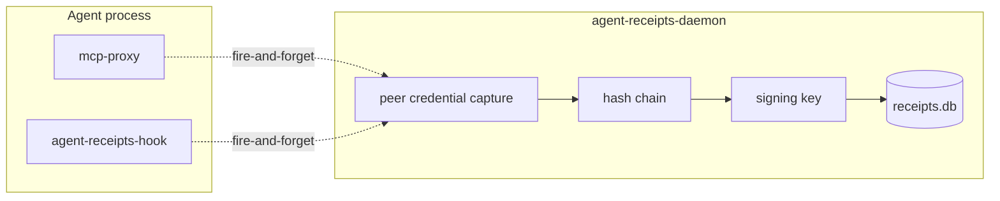

_Published 2026-05-18_ · **Series: Auditing AI Agents** · Part 1 of 3

---

An agent that signs its own audit trail isn't being audited.

---

## The original design

The first version of Agent Receipts was deliberately small: each MCP proxy instance loaded an Ed25519 signing key, maintained its own SQLite database, and signed and stored a receipt for every tool call it intercepted — all in the same process as the agent.

The cryptography worked. The audit property didn't. When the signing process and the audited process are the same, the auditor is holding its own signing key. It can sign what it likes, drop what it doesn't, and nothing outside the process can disagree.

A second limitation came from running more than one MCP proxy at once — the usual case when an agent talks to several MCP servers. Each proxy kept its own chain, with no shared sequence between them. Correlating a GitHub tool call with a filesystem tool call meant application-level join logic instead of one query.

---

## The decision

[ADR-0010](https://github.com/agent-receipts/ar/blob/main/docs/adr/0010-daemon-process-separation.md) split every integration into two roles.

**Thin emitter** — the plugin, proxy, or SDK serialises the tool call, writes it to a local Unix socket, and moves on. Signing, storage, and chaining are the daemon's concern; the agent is never blocked waiting for the audit layer. If the daemon is running but backpressured, the emitter increments a local drop counter and flushes it on the next successful send, so the daemon can record the gap as an `events_dropped` receipt in the chain. If the daemon isn't running at all, events drop without trace — that case is detectable from outside the chain, via service-manager status and the absence of fresh receipts.

**agent-receipts-daemon** — a separate process running as its own OS user, sole owner of the signing keys and the SQLite database. Receives events, captures peer credentials at the kernel level, canonicalises inputs (RFC 8785), hash-chains, signs (Ed25519), and persists.



The agent process can't reach the signing keys or the database. The separation is structural, not policy.

---

## Peer credential capture

The daemon doesn't take the emitter's word for who it is. The moment a connection lands on the socket, it asks the kernel directly:

- **macOS**: `LOCAL_PEERCRED` for uid/gid, `LOCAL_PEEREPID` for pid, then `proc_pidpath` for the executable path
- **Linux**: `SO_PEERCRED` for uid, gid, pid, then `/proc/<pid>/exe` for the executable path

These come straight from the kernel. The connecting process can lie about anything in its payload, but not about who it is. The daemon stamps every receipt with that identity, so an auditor can answer not just *what* was called but *which process* called it — by uid, pid, and executable path.

---

## One chain, all channels

Because every emitter connects to the same daemon socket, all receipts land in one chain with a single monotonic sequence. An agent session that talks to three MCP servers and fires native tool calls through the Claude Code hook produces one chain — not four.

Cross-channel correlation collapses to one query: every receipt for a session carries the same `session_id`, regardless of which emitter captured the call.

---

## The tradeoff

The daemon is a system service. That's friction the old `npm install` flow didn't have. It requires installation, a signing key, and a service manager entry (launchd on macOS, systemd on Linux).

That's the cost of an audit boundary that means something. In-process signing is simpler to install; it just isn't the audit boundary.

Homebrew handles most of it:

```sh
brew install agent-receipts/tap/agent-receipts-daemon
brew services start agent-receipts-daemon
```

---

## What it looks like in practice

Receipts are W3C Verifiable Credentials, Ed25519-signed, hash-chained. Here's a real one from this session, signature and hashes abbreviated:

```json
{
  "action": {
    "type": "mcp.github.pull_request_read",
    "parameters_hash": "sha256:2f9911eb..."
  },
  "credentialSubject": {
    "chain": { "sequence": 2046, "chain_id": "default" }
  },
  "proof": {
    "type": "Ed25519Signature2020",
    "verificationMethod": "did:agent-receipts-daemon:local#k1",
    "proofValue": "uZ7aqJ4Zfq..."
  }
}
```

That signing key — `did:agent-receipts-daemon:local#k1` — lives only in the daemon. The agent process that triggered this call has never seen it.

---

## What comes next

The daemon is the trust anchor for everything that follows: secret redaction before storage (already shipped), asymmetric payload encryption so only a forensic key holder can read stored inputs, centralised storage for cross-machine audit trails. All of it depends on having one trusted process that owns the keys and the chain.
