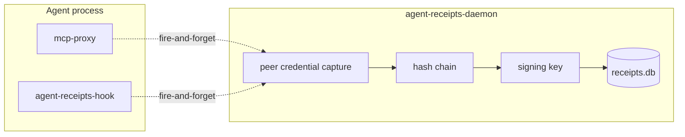

An agent that signs its own audit trail isn't being audited. It's writing its own report card.

This sounds obvious when you say it out loud. It took building the first version of Agent Receipts to see it clearly.

---

## The original design

The first version of Agent Receipts worked like this: each MCP proxy instance loaded an Ed25519 signing key, maintained its own SQLite database, and signed and stored a receipt for every tool call it intercepted — all in the same process as the agent.

It produced real cryptographic signatures. The hash chain was valid. Receipts could be verified. But the security property was hollow: the process doing the auditing was the same process being audited. A compromised or misbehaving agent could suppress receipts, forge them, or simply not write them. The signing key was right there in memory.

There was a second problem. Running multiple MCP proxy instances — which is the normal case when an agent uses several MCP servers — meant multiple independent chains with no shared sequence space. Correlating a GitHub tool call with a filesystem tool call meant writing application-level join logic, not querying one table.

---

## The decision

ADR-0010 split every integration into two roles.

**Thin emitter** — the plugin, proxy, or SDK fires an event describing the tool call. No signing. No storage. No crypto. Fire-and-forget over a local Unix socket. The agent is never blocked waiting for the audit layer. If the daemon is running but backpressured, the emitter increments a local drop counter and flushes it on the next successful send, so the daemon can record the gap as an `events_dropped` receipt in the chain. If the daemon isn't running at all, events drop without trace — that case is detectable from outside the chain, via service-manager status and the absence of fresh receipts.

**agent-receipts-daemon** — a separate process running as its own OS user, sole owner of the signing keys and the SQLite database. Receives events, captures peer credentials at the kernel level, canonicalises inputs (RFC 8785), hash-chains, signs (Ed25519), and persists.



The agent process no longer has access to the signing keys. It cannot read the database. It cannot forge, suppress, or tamper with its own receipts — not because we trust it, but because it structurally cannot.

---

## Peer credential capture

The daemon doesn't trust the emitter's identity claims. At connection accept time it captures OS-level peer credentials from the socket itself:

- **macOS**: `LOCAL_PEERCRED` for uid/gid, `LOCAL_PEEREPID` for pid, then `proc_pidpath` for the executable path
- **Linux**: `SO_PEERCRED` for uid, gid, pid, then `/proc/<pid>/exe` for the executable path

These are kernel-attested. The connecting process cannot forge them. The daemon records them on every receipt, so an auditor can verify not just *what* was called but *which process* called it — by uid, pid, and executable path.

---

## One chain, all channels

Because all emitters connect to the same daemon socket, all receipts go into one chain with a global monotonic sequence. An agent session that uses three MCP servers and fires native tool calls via the Claude Code hook produces one chain — not four.

Cross-channel correlation falls out naturally: find all receipts with the same `session_id` and you have the complete tool call history for that session, regardless of which emitter captured each call.

---

## The tradeoff

The daemon is a system service. That's friction the old `npm install` story didn't have. It requires installation, a signing key, and a service manager entry (launchd on macOS, systemd on Linux).

That's the price of the security property. An in-process solution that's easy to install doesn't audit anything meaningful. A separate trusted process that requires setup does.

Homebrew handles most of it:

```sh
brew install agent-receipts/tap/agent-receipts-daemon
brew services start agent-receipts-daemon
```

---

## What it looks like in practice

The receipts are W3C Verifiable Credentials, Ed25519-signed, hash-chained. A real one from this session (hashes and signature abbreviated):

```json
{
  "action": {
    "type": "mcp.github.pull_request_read",
    "parameters_hash": "sha256:2f9911eb..."
  },
  "credentialSubject": {
    "chain": { "sequence": 2046, "chain_id": "default" }
  },
  "proof": {
    "type": "Ed25519Signature2020",
    "verificationMethod": "did:agent-receipts-daemon:local#k1",
    "proofValue": "uZ7aqJ4Zfq..."
  }
}
```

The signing key (`did:agent-receipts-daemon:local#k1`) lives only in the daemon. The agent process that triggered this call has never seen it.

---

## What comes next

The daemon is the trust anchor for everything that follows: secret redaction before storage (already shipped), asymmetric payload encryption so only a forensic key holder can read stored inputs, centralised storage for cross-machine audit trails. All of it depends on having one trusted process that owns the keys and the chain.

The next post puts the first two together — a live demo of the unified chain and secret redaction working end to end.
