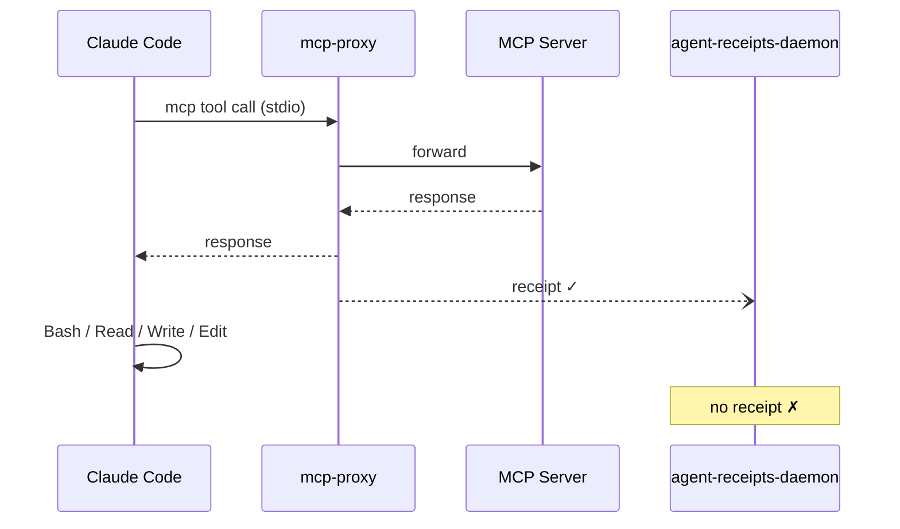
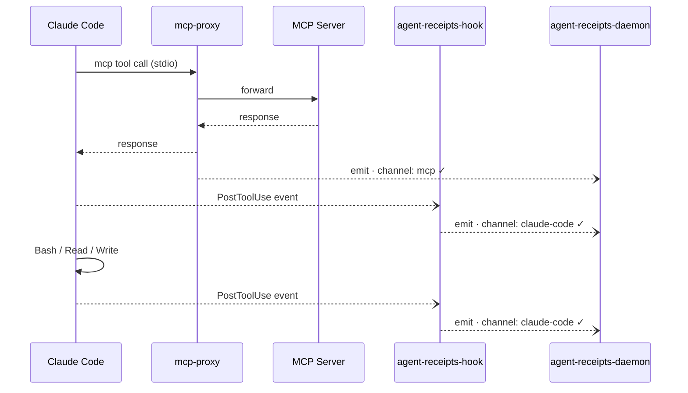

import { Aside } from '@astrojs/starlight/components';

The MCP proxy covers MCP tool calls. Everything that flows through an MCP server — GitHub API calls, database queries, Atlassian writes — is intercepted, receipted, and hash-chained. But Claude Code has another class of tools that never touch an MCP server at all.

`Bash`. `Read`. `Write`. `Edit`. `WebFetch`. `WebSearch`.

These are native tools — built into Claude Code itself. They run locally, directly, with no proxy in between. Without additional instrumentation, they're invisible to the audit trail. A receipt chain that captures every GitHub API call but misses every file write isn't a complete audit.

---

## The gap

Here's what a typical Claude Code session looks like without the hook:



The daemon chain has gaps wherever native tools ran. An auditor sees the MCP calls but not the file system activity, shell commands, or web fetches that happened between them.

---

## The hook

Claude Code exposes a `PostToolUse` hook — a shell command it calls after every tool completes, passing a JSON payload describing the call. The `agent-receipts-hook` binary reads that payload and forwards it to the daemon over the same Unix socket the MCP proxy uses.



All emitters — the proxy and the hook — fire to the same daemon socket. The daemon assigns consecutive sequence numbers. One chain, all channels.

---

## Installation

One entry in `~/.claude/settings.json`:

```json
{
  "hooks": {
    "PostToolUse": [
      {
        "matcher": "",
        "hooks": [
          {
            "type": "command",
            "command": "agent-receipts-hook"
          }
        ]
      }
    ]
  }
}
```

The empty `matcher` means the hook fires for every tool. The `agent-receipts-hook` binary needs to be on `$PATH` — install it via Homebrew:

```sh
brew install agent-receipts/tap/agent-receipts-hook
```

That's it. No MCP server to wrap, no proxy config to write. The next tool call you make will land a receipt.

---

## What a native tool receipt looks like

Here's a real `Bash` receipt from a Claude Code session, captured while running a shell command that included a fake API key:

```json
{
  "action": {
    "type": "claude-code.Bash",
    "tool_name": "Bash",
    "risk_level": "medium",
    "parameters_hash": "sha256:dc143db4ad2fd5df10685749c688e018610dfb254bd75bbf753ed3ddd84d97a2",
    "parameters_disclosure": {
      "input": "{\"command\":\"echo \\\"Connecting with api_key=[REDACTED] to service\\\"\"}",
      "output": "{\"stdout\":\"Connecting with api_key=[REDACTED] to service\",\"stderr\":\"\"}",
      "peer.platform": "darwin",
      "peer.uid": "501",
      "peer.pid": "74389"
    }
  },
  "outcome": { "status": "success" },
  "chain": {
    "sequence": 2051,
    "chain_id": "default"
  }
}
```

A few things worth noting:

**`action.type` prefix is `claude-code.`** — every hook-sourced receipt carries this prefix, so you can filter by channel at query time.

**Secrets are redacted** — the `api_key=sk-...` value was caught by the daemon's built-in redaction patterns before the receipt was stored. The `parameters_hash` still commits to the original unredacted input, so the call is verifiable without the secret being retained.

**Peer credentials** — the daemon captured the hook process's uid, pid, and platform at socket connect time, independent of anything the hook claims about itself.

---

## Side by side with an MCP call

When the hook and the MCP proxy both fire for the same underlying call (an MCP tool call triggers both a proxy intercept and a PostToolUse event), you get two consecutive receipts in the chain:

| seq | channel | action.type | parameters_hash |
|-----|---------|-------------|-----------------|
| 2046 | mcp-proxy | `mcp.github.pull_request_read` | `sha256:2f9911...` |
| 2047 | hook | `claude-code.mcp__github-audited__pull_request_read` | `sha256:2f9911...` |

The identical `parameters_hash` correlates the two receipts to the same underlying call. An auditor can verify from either receipt that the same input was processed.

<Aside type="note">
The two receipts carry different `session_id` values — the hook forwards Claude Code's session ID while the proxy generates its own per-process UUID. Cross-channel correlation by `parameters_hash` is the reliable key today.
</Aside>

---

## Fail-hard, not silent

When the daemon is unreachable, the hook exits non-zero. Claude Code surfaces this as a visible non-blocking error in the session — the tool call still completes, but the gap is visible rather than silent.

This is a deliberate design choice. Silent drops mean invisible audit gaps. A visible error means an operator knows to investigate whether the daemon is down.

---

## Why PostToolUse and not PreToolUse?

This is the first question people ask. The short answer: audit first, policy second — and for good reason.

`PreToolUse` hooks fire *before* the tool runs. Exiting non-zero blocks the call. That sounds powerful, but it changes the contract: you're no longer just observing, you're in the critical path. If the hook is slow, the agent is slow. If the hook crashes, the tool call fails — even for calls that should succeed. If the hook blocks something it shouldn't, the agent is broken in a way that's hard to debug.

`PostToolUse` has none of these failure modes. The tool has already run. The hook fires after the fact. If it crashes or times out, the agent doesn't notice — the call completed, Claude Code continues. The audit trail has a gap, not a breakage.

There's also an information argument. A `PostToolUse` hook sees the *output* — what the tool actually returned. A `PreToolUse` hook only sees the *intent* — what the agent asked for. For forensics and breach investigation, the output is often the more interesting half.

The current approach is deliberate: ship the audit foundation with the lowest possible blast radius, get it running in production, then add policy enforcement once the system is trusted. The MCP proxy already does `PreToolUse`-equivalent blocking for MCP calls. The hook will follow the same path once the audit baseline is solid.

<Aside type="note">
There's also a technical complication specific to short-lived hook processes: the drop-counter mechanism that makes backpressure visible in the chain doesn't work naturally when the emitter process exits after every call. That design question is being resolved before `PreToolUse` lands, so new event types don't inherit the silent-drop gap.
</Aside>

---

## The complete picture

With both the MCP proxy and the hook in place, a Claude Code session produces one chain covering everything:

- Every MCP tool call — intercepted and receipted by the proxy
- Every native tool call — captured and receipted by the hook
- All in one hash-chained sequence, signed by the daemon

An agent that could previously obscure its activity by choosing native tools over MCP calls no longer has that option. The chain is complete.
