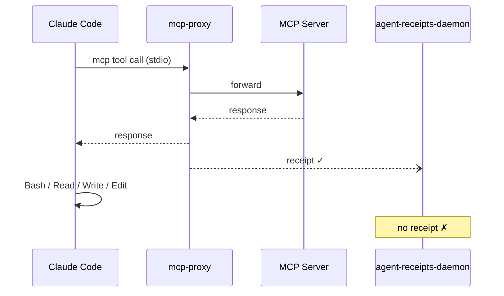
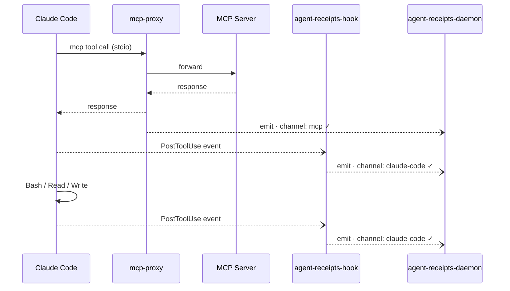

import { Aside } from '@astrojs/starlight/components';

_Published 2026-05-28_ · **Series: Auditing AI Agents** · Part 3 of 3 · [← One Chain, Two Channels, Zero Secrets](/blog/unified-chain-redaction-demo/)

---

The MCP proxy covers MCP tool calls. Everything that flows through an MCP server — GitHub API calls, database queries, Atlassian writes — is intercepted, receipted, and hash-chained. But Claude Code has another class of tools that never touch an MCP server at all.

`Bash`. `Read`. `Write`. `Edit`. `WebFetch`. `WebSearch`.

These are native tools — built into Claude Code itself. They run locally, directly, with no proxy in between. Without additional instrumentation, they're invisible to the audit trail. A receipt chain that captures every GitHub API call but misses every file write isn't a complete audit.

---

## The gap

Here's what a typical Claude Code session looks like without the hook:



The daemon chain has gaps wherever native tools ran. An auditor sees the MCP calls but not the file system activity, shell commands, or web fetches that happened between them.

---

## The hook

Claude Code exposes a `PostToolUse` hook — a shell command it calls after every tool completes, passing a JSON payload describing the call. The `agent-receipts-hook` binary reads that payload and forwards it to the daemon over the same Unix socket the MCP proxy uses.



All emitters — the proxy and the hook — fire to the same daemon socket. The daemon assigns consecutive sequence numbers. One chain, all channels.

---

## Installation

One entry in `~/.claude/settings.json`:

```json
{
  "hooks": {
    "PostToolUse": [
      {
        "matcher": "",
        "hooks": [
          {
            "type": "command",
            "command": "agent-receipts-hook"
          }
        ]
      }
    ]
  }
}
```

The empty `matcher` means the hook fires for every tool. The `agent-receipts-hook` binary needs to be on `$PATH` — install it via Homebrew:

```sh
brew install agent-receipts/tap/agent-receipts-hook
```

That's it. No MCP server to wrap, no proxy config to write. The next tool call you make will land a receipt.

---

## What a native tool receipt looks like

Here's a real `Bash` receipt from a Claude Code session, captured while running a shell command that included a fake API key:

```json
{
  "action": {
    "type": "claude-code.Bash",
    "tool_name": "Bash",
    "risk_level": "medium",
    "parameters_hash": "sha256:dc143db4ad...",
    "parameters_disclosure": {
      "input": "{\"command\":\"echo \\\"Connecting with api_key=[REDACTED] to service\\\"\"}",
      "output": "{\"stdout\":\"Connecting with api_key=[REDACTED] to service\",\"stderr\":\"\"}",
      "peer.platform": "darwin",
      "peer.uid": "501",
      "peer.pid": "74389"
    }
  },
  "credentialSubject": {
    "outcome": { "status": "success" },
    "chain": { "sequence": 2051, "chain_id": "default" }
  },
  "proof": {
    "type": "Ed25519Signature2020",
    "verificationMethod": "did:agent-receipts-daemon:local#k1",
    "proofValue": "uZ8bqK5Zgr..."
  }
}
```

A few things worth noting:

**`action.type` prefix is `claude-code.`** — every hook-sourced receipt carries this prefix, so you can filter by channel at query time.

**Secrets are redacted** — the `api_key=sk-...` value was caught by the daemon's built-in redaction patterns before the receipt was stored. The `parameters_hash` still commits to the original unredacted input, so the call is verifiable without the secret being retained.

**Peer credentials** — the daemon captured the hook process's uid, pid, and platform at socket connect time, independent of anything the hook claims about itself.

---

## Side by side with an MCP call

When the hook and the MCP proxy both fire for the same underlying call (an MCP tool call triggers both a proxy intercept and a PostToolUse event), you get two consecutive receipts in the chain:

| seq | emitter | action.type | parameters_hash |
|-----|---------|-------------|-----------------|
| 2046 | mcp-proxy | `mcp.github.pull_request_read` | `sha256:2f9911...` |
| 2047 | hook | `claude-code.mcp__github-audited__pull_request_read` | `sha256:2f9911...` |

The identical `parameters_hash` correlates the two receipts to the same underlying call. An auditor can verify from either receipt that the same input was processed.

<Aside type="note">
The two receipts carry different `session_id` values — the hook forwards Claude Code's session ID while the proxy generates its own per-process UUID. Cross-channel correlation by `parameters_hash` is the reliable key today.
</Aside>

---

## Fail-hard, not silent

When the daemon is unreachable, the hook exits non-zero. Claude Code surfaces this as a non-blocking error in the session — the tool call still completes, but the missing receipt is reported rather than swallowed.

This is a deliberate design choice. Silent drops mean invisible audit gaps. A visible error means an operator knows to investigate whether the daemon is down.

---

## Why PostToolUse and not the other hook events?

Claude Code's [hooks system](https://code.claude.com/docs/en/hooks) now exposes close to 30 lifecycle events: `PreToolUse`, `PostToolUse`, `PostToolUseFailure`, `UserPromptSubmit`, `SessionStart`, `SessionEnd`, `Stop`, `SubagentStop`, `PreCompact`, `Notification`, `WorktreeCreate`, `WorktreeRemove`, and many more. Each represents a different moment in the agent's lifecycle.

The recommended Agent Receipts configuration wires up `PostToolUse` only. That's deliberate.

**Audit first, policy second.** `PreToolUse` can block a tool call by exiting non-zero — which puts the hook in the critical path. If it's slow, the agent is slow. If it crashes, the tool call fails. If it incorrectly blocks something, the agent breaks in ways that are hard to debug. `PostToolUse` has none of these failure modes: the tool has already run, the hook fires after the fact, and a failure to record surfaces as a non-blocking error rather than a broken tool call. The audit trail has a gap, not a breakage.

**The output is more interesting than the intent.** A `PostToolUse` hook sees what the tool *returned*. A `PreToolUse` hook only sees what the agent *asked for*. For forensics and breach investigation, the output — what actually came back — is often the more useful half of the record.

**Expanding deliberately.** `SessionStart`, `UserPromptSubmit`, and `Stop` are natural next candidates: they would let the chain record session boundaries and the prompts that triggered tool use, not just the tool calls themselves. Each new event type adds surface area, and there's a wire-format question to resolve first — see the note below.

The MCP proxy already does `PreToolUse`-equivalent blocking for MCP calls. The hook will follow the same path — audit baseline first, then policy enforcement once it's proven in production.

<Aside type="note">
ADR-0010's drop-counter relies on a long-lived emitter to count and report frames the daemon couldn't ingest. A short-lived hook process has nowhere to keep that count between invocations. Resolving this is a prerequisite for broader event coverage, so new event types don't inherit a silent-drop gap.
</Aside>

---

## Why Go and not Rust?

Rust would produce a smaller, faster binary with compile-time memory safety guarantees. It's a reasonable question.

The honest answer is that the emitter is designed to be so thin that language choice barely matters. Its entire job is: read stdin, open a Unix socket, write a length-prefixed frame, close. The 25ms dial timeout and 100ms write timeout are the latency budget — not the language runtime. A Rust binary would hit those same wall-clock limits. The bottleneck is IPC, not CPU or memory.

The safety argument for Rust is real but narrow here. The emitter does no manual memory management, no pointer arithmetic, no unsafe operations — nothing that exercises the failure modes Rust's borrow checker is designed to prevent. Go's runtime covers what little surface there is.

There's also a practical argument: the hook binary uses the Go emitter package directly, sharing code with the daemon, the SDK, and the proxy. Rust would mean a separate implementation of the IPC framing, the frame schema, and the timeout logic — more surface area for drift between the hook and every other emitter in the system.

If the emitter ever needs to do heavy local processing before forwarding — structured field extraction, client-side pattern matching, local buffering for offline operation — that calculus changes. For fire-and-forget over a Unix socket, Go is more than adequate.

---

## The complete picture

With both the MCP proxy and the hook in place, a Claude Code session produces one chain covering everything:

- Every MCP tool call — intercepted and receipted by the proxy
- Every native tool call — captured and receipted by the hook
- All in one hash-chained sequence, signed by the daemon

Without the hook, a Claude Code session's audit trail skips over whatever happened through native tools — file writes, shell commands, web fetches. With both in place, every tool call from the session lands in one signed, hash-chained sequence.
