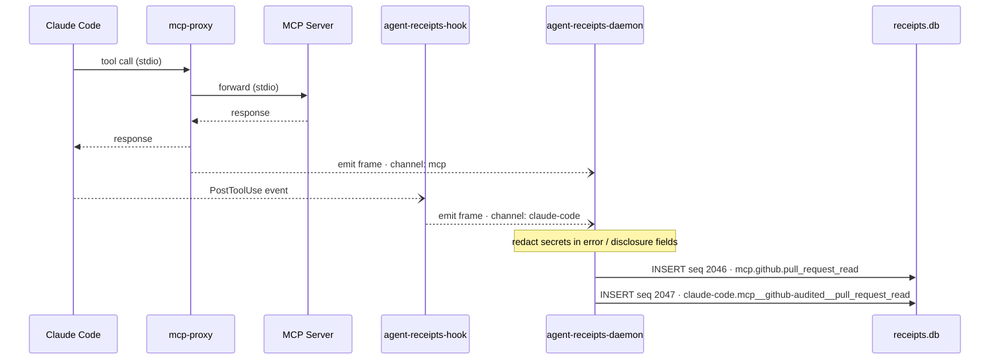
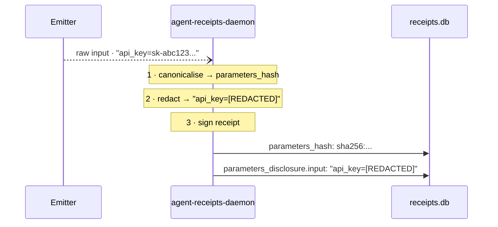

import { Aside } from '@astrojs/starlight/components';

_Published 2026-05-21_ · **Series: Auditing AI Agents** · Part 2 of 3 · [← The audit boundary belongs outside the agent](/blog/daemon-process-separation/)

---

This post walks through two things that landed together in `agent-receipts-daemon v0.10.0`: a unified receipt chain that captures both native Claude Code tool calls and MCP tool calls in a single sequence, and automatic secret redaction before any payload reaches the database.

The receipts below are real.

---

## The problem with two stores

Before v0.10.0, the picture looked like this:

- The **MCP proxy** signed and stored receipts in its own `receipts.db`
- The **Claude Code hook** forwarded events to the daemon, which stored them in the daemon's `receipts.db`

Two databases, two chains, and no way to correlate a native `Bash` call with the MCP tool call that triggered it inside the same audit trail.

ADR-0010 (Daemon Process Separation) was always meant to fix this: one daemon, one chain, all emitters forwarding events to it. v0.10.0 completes that picture.

---

## One call, two receipts, one chain

Here's what happens when Claude Code makes a GitHub MCP call today. The proxy intercepts it (it's an MCP call over stdio) and the hook fires after it completes (it's a PostToolUse event). Both emitters forward to the daemon, which assigns consecutive sequence numbers.



Both frames carry the same `parameters_hash` — the daemon hashes inputs canonically before any emitter can tamper with them. The dashed arrows (fire-and-forget) mean neither emitter blocks waiting for the receipt to land.

**Sequence 2046 — from the MCP proxy:**

```json
{
  "action": {
    "type": "mcp.github.pull_request_read",
    "tool_name": "pull_request_read",
    "parameters_hash": "sha256:2f9911eb87456bd0e3bffe3834529e18300cd5ca311547a8e45717992303c70f"
  },
  "chain": {
    "sequence": 2046,
    "chain_id": "default"
  }
}
```

**Sequence 2047 — from the Claude Code hook:**

```json
{
  "action": {
    "type": "claude-code.mcp__github-audited__pull_request_read",
    "tool_name": "mcp__github-audited__pull_request_read",
    "parameters_hash": "sha256:2f9911eb87456bd0e3bffe3834529e18300cd5ca311547a8e45717992303c70f"
  },
  "chain": {
    "sequence": 2047,
    "chain_id": "default"
  }
}
```

Same `parameters_hash`. Consecutive sequence numbers, milliseconds apart. Different emitters — one the proxy (pid 53707), one the hook (pid 74061) — both attested by the daemon's peer credential capture.

The `action.type` prefix tells you which channel produced each receipt: `mcp.*` for the proxy, `claude-code.*` for the hook.

<Aside type="note">
The two receipts have different `session_id` values — the hook forwards Claude Code's session ID while the proxy generates its own per-process UUID. Cross-channel correlation by `parameters_hash` is the reliable key for now; session ID unification is tracked separately.
</Aside>

---

## Peer attestation

Both receipts include `parameters_disclosure.peer.*` — the OS-level credentials the daemon captured at connection time, independent of anything the emitter claims:

```json
"parameters_disclosure": {
  "peer.platform": "darwin",
  "peer.uid": "501",
  "peer.gid": "20",
  "peer.pid": "53707",
  "peer.exe_path": ""
}
```

The daemon captures these at socket accept time, kernel-attested — the emitter cannot forge them. `uid` and `gid` come from `LOCAL_PEERCRED`, which snapshots them the moment the connection lands; they always come through. `pid` and `exe_path` are looked up just after via `LOCAL_PEEREPID` + `proc_pidpath`. Short-lived emitters that have already disconnected by then — the hook in particular, one connection per frame — leave those two empty (`LOCAL_PEEREPID` returns `ENOTCONN`). The kernel always wins on uid/gid; pid/exe_path is best-effort by design.

---

## Secret redaction

The `parameters_disclosure` feature has a history. It started as `parameterPreview` inside the [OpenClaw plugin](https://github.com/agent-receipts/openclaw) — a way to store a sanitised preview of tool call parameters alongside the hash, so auditors could see *what* was called without needing to re-run the tool ([how the plugin works](/blog/openclaw-plugin-deep-dive/)). The [first end-to-end trial](https://jongerius.solutions/post/agent-receipts-openclaw-v0-trial/) put it to work in anger, and an obvious question surfaced almost immediately: what happens when a tool call argument contains an API key or a password? The preview stores it. Forever. In a signed record.

That question drove two things: the rename from `parameterPreview` → `parameterDisclosure` (the field carries disclosure, not a safe preview), and the redaction system now in the daemon. The idea was ported from the plugin to the main project precisely because the daemon is the right place for it — every emitter funnels through the same daemon socket, so redaction applied there runs unconditionally, regardless of which emitter sent the event.

With `--parameter-disclosure` enabled, the daemon stores plaintext inputs and outputs in the receipt's `parameters_disclosure` field. Without redaction, that's a liability — any secret in a tool call argument or response would end up in a signed, immutable record.



The hash in step 1 commits to the original bytes. An auditor who later obtains the raw input can verify it matches. The redacted text in step 2 is what gets signed and stored — the secret never reaches the database.

v0.10.0 adds redaction to the pipeline. Built-in patterns cover:

- GitHub PATs (`ghp_`, `github_pat_`, `gho_`, `ghs_`, `ghu_`)
- OpenAI / Anthropic keys (`sk-...`)
- AWS access key IDs (`AKIA...`)
- Bearer tokens in HTTP headers
- Slack tokens (`xox[bpras]-...`)
- PEM private key blocks
- URL query-string tokens (`?token=`, `?api_key=`, ...)
- JSON keys: `password`, `api_key`, `token`, `secret`, `authorization`, `jwt`, and 20+ more

Here's the live demo. This Bash command was run in a Claude Code session:

```bash
sleep 1 && echo "Connecting with api_key=sk-fakekey12345678901234 to service"
```

The resulting receipt:

```json
"parameters_disclosure": {
  "input": "{\"command\":\"sleep 1 && echo \\\"Connecting with api_key=[REDACTED] to service\\\"\",\"description\":\"Trigger tool call with fake API key in output\"}",
  "output": "{\"stdout\":\"Connecting with api_key=[REDACTED] to service\",\"stderr\":\"\",\"interrupted\":false}",
  "peer.platform": "darwin",
  "peer.uid": "501",
  "peer.pid": "74389"
}
```

The secret is gone from both the command string and the stdout — caught in both places by the `sk-` pattern. The receipt is signed and chain-linked; the hash still commits to the original input, but the redacted form is the only text the database, and any subsequent reader, ever sees.

Custom redaction patterns can be added via `--redact-patterns <file.yaml>` (or `AGENTRECEIPTS_REDACT_PATTERNS`):

```yaml
patterns:
  - name: internal-api-key
    pattern: 'MYCO-[A-Z0-9]{16}'
```

---

## What this enables

Every native tool call and every MCP tool call from a Claude Code session now lands in one chain, hash-linked and signed, with secrets sanitised before storage. An auditor can:

- Query by `action.type` prefix to filter by channel (`claude-code.*` vs `mcp.*`)
- Correlate cross-channel calls by `parameters_hash` when both channels capture the same event
- Verify any receipt's signature and hash chain offline with `agent-receipts verify`
- Inspect recent receipts with `agent-receipts list --json | jq ...`

The daemon is the only process that persists receipts and holds the signing key — emitters are fire-and-forget, no local storage. If the daemon is down, the hook logs a visible non-blocking error and the tool call completes normally; no receipt is written for that call and the gap is visible in the chain on restart.

---

## What's next

- **Centralised storage** — the daemon today writes to a local SQLite file. The natural next step is a remote sink: ship receipts from multiple agents and machines to a shared store — Postgres, S3, or an OTel-compatible backend — so cross-agent audit trails can be correlated in one place
- **`parameters_disclosure` encryption** (#280) — replacing plaintext disclosure with asymmetric ciphertext so only the forensic key holder can read stored inputs; the redaction layer ships first so secrets are never written even in the interim
- **Breach-indicator flagging** (#436) — daemon-side pattern matching at emit time, writing indexed flags alongside receipts for efficient breach investigation queries without needing to decrypt stored payloads
