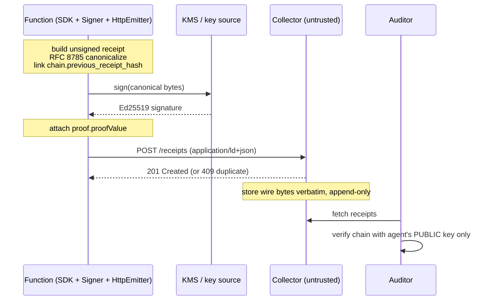

Ephemeral compute — AWS Lambda, GCP Cloud Run, AWS Fargate, Azure Functions — has no long-lived process to host the `agent-receipts-daemon`. The daemon model ([Daemon Setup](/getting-started/daemon-setup/)) assumes a persistent sidecar holding the signing key and a local socket; neither survives between invocations on serverless platforms.

[ADR-0020](https://github.com/agent-receipts/ar/blob/main/docs/adr/0020-emitter-abstraction-and-remote-receipt-delivery.md) makes ephemeral compute a first-class target by inverting the daemon model: **signing and chaining move client-side, into the SDK process**, and receipts are POSTed to an untrusted [collector](https://github.com/agent-receipts/ar/tree/main/collector) over HTTP. This guide shows how the pieces fit, how to manage keys without an extractable PEM in production, the gotchas per runtime, and what auditors see when an invocation is killed mid-chain.

:::note
The `HttpEmitter` (all three SDKs) and the reference collector have shipped. The production **KMS signing path** is partially shipped — see [Key management](#key-management) — so the worked examples use a raw-PEM key as the development story and call out the KMS production story where it is still being wired up.
:::

## Architecture

### The four moving parts

| Component | Where it runs | Responsibility |
|-----------|---------------|----------------|
| **SDK** | Inside your function/container | Builds the receipt, hashes payloads, links the chain |
| **Signer** | Inside your function (or delegated to KMS/HSM) | Produces the Ed25519 signature over canonical bytes |
| **`HttpEmitter`** | Inside your function | POSTs the signed receipt to the collector |
| **Collector** | A long-lived service you operate | Stores received receipts append-only; never signs, reorders, or verifies |

Receipt construction, signing, and chaining are **upstream of the emitter**. The `Emitter` interface is delivery-only — `emit(receipt)` takes an already-signed `AgentReceipt`. ([ADR-0020 § "Emitter interface"](https://github.com/agent-receipts/ar/blob/main/docs/adr/0020-emitter-abstraction-and-remote-receipt-delivery.md).)

### Data flow



### Trust model

The collector is **not trusted for chain construction**. Every receipt is signed and chained client-side before it leaves the function, so a compromised or malicious collector can drop or refuse receipts but cannot forge, alter, or reorder them. Auditors verify the chain using **only the agent's public key** — never the collector. This is what makes shared, multi-tenant collector infrastructure safe. ([Collector trust model](https://github.com/agent-receipts/ar/blob/main/collector/README.md).)

The collector performs **no signature verification** — that is the auditor's job. It validates structure only (valid JSON, under the body cap, and the presence of `id`, `credentialSubject.chain.chain_id`, `credentialSubject.action.type`, and `proof.proofValue`).

### Where chaining happens — and the concurrency constraint

Client-side chaining requires that receipt *N* is fully signed and its hash computed **before** receipt *N+1* is constructed ([ADR-0020 § "Concurrency constraint"](https://github.com/agent-receipts/ar/blob/main/docs/adr/0020-emitter-abstraction-and-remote-receipt-delivery.md)). For a sequential single-process agent this is automatic. Two consequences for ephemeral compute:

- **Parallel tool calls must be serialised at the receipt layer.** Even when tool calls execute concurrently, receipt construction must pass through a single queue. Concurrent signing of independent receipts is not supported in v1. Each SDK ships a `ReceiptChain` (Go: `chain.ReceiptChain`) that owns the chain head and serialises build → sign → hash → link → deliver through an internal queue, so concurrent `emit()` calls are sequenced even when the tool calls ran in parallel; the first overlapping call logs a one-shot warning. Use it instead of threading `previous_receipt_hash` by hand. See the per-SDK READMEs ([Go](https://github.com/agent-receipts/ar/tree/main/sdk/go#sequential-receipt-construction-parallel-tool-calls) · [TypeScript](https://github.com/agent-receipts/ar/tree/main/sdk/ts#emit-a-chain-sequential-construction-under-parallel-tool-calls) · [Python](https://github.com/agent-receipts/ar/tree/main/sdk/py#sequential-receipt-construction-parallel-tool-calls)).
- **Each execution environment owns its own chain.** Serverless platforms scale horizontally — many isolated instances run at once, and a cold start gives you a fresh process. A single linear chain cannot span concurrent invocations. Give each invocation (or each warm instance's lifetime) its own `chain_id`; reconcile across invocations downstream by `chain_id`, not by trying to thread one chain through the fleet.

## Key management

### Why a raw PEM in an env var is the wrong production answer

`EnvVarKeyProvider`-style "paste the PKCS#8 PEM into `AGENTRECEIPTS_KEY`" is the baseline that works everywhere and is fine for development, CI, and low-stakes workloads. It is the **wrong** answer when extractable private keys are unacceptable, because:

- The key sits in the function's environment, readable by anything in-process and by anyone with deploy-time or console access to the configuration.
- It is trivially exfiltrated by a compromised dependency — the exact threat the protocol exists to make evident.
- Rotation means redeploying every function with new configuration.

### Cloud KMS / HSM signers

[ADR-0018](https://github.com/agent-receipts/ar/blob/main/docs/adr/0018-signer-abstraction-and-cloud-agnostic-keyprovider-design.md) defines a `Signer` abstraction so the private key never leaves a KMS or HSM. The signer signs canonical bytes remotely and exposes the public key for verifiers:

```
Signer:
  sign(message)      -> Ed25519 signature (computed inside KMS)
  getPublicKey()     -> raw 32-byte Ed25519 public key (RFC 8032 §5.1.5)
```

The AWS **`KMSSigner`** has shipped in the Go SDK's `aws` module (`github.com/agent-receipts/ar/sdk/go/aws`). It uses an `ECC_NIST_EDWARDS25519` KMS key with `SIGN_VERIFY` usage, signs via `kms:Sign` with `ED25519_SHA_512` / `MessageType=RAW` (standard pure Ed25519), and resolves credentials from the ambient AWS chain (instance role, IRSA, environment, shared profile).

:::caution
Two parts of the KMS production story are still landing (tracked in [#534](https://github.com/agent-receipts/ar/issues/534)):

- **GCP Cloud KMS and Azure Key Vault adapters**, and the TypeScript/Python `KMSSigner` equivalents, are not yet shipped. Only the AWS Go `KMSSigner` exists today.
- **Wiring a `Signer` into receipt signing.** The core `Sign`/`signReceipt`/`sign_receipt` functions currently take a PEM private key, not a `Signer`. Until the `Signer`-based signing path lands, the runnable story is raw-PEM; treat KMS as the production target you migrate to when that path ships.

For production today, the practical bridge is to keep the PEM in a secrets manager (AWS Secrets Manager, GCP Secret Manager, Azure Key Vault) fetched at cold start under the function's instance role, rather than baking it into static configuration — narrower than KMS-resident keys, but it keeps the key out of deploy-time config and gives you one place to rotate.
:::

### Amortising the cold-start public-key fetch

A KMS-backed signer's **first** `getPublicKey()` makes a network round-trip to KMS; the Go `KMSSigner` caches the result for the signer's lifetime, so subsequent calls are free. On ephemeral compute this cold-start cost recurs on every fresh execution environment. Amortise it by:

- Constructing the signer **once at module/global scope**, outside the request handler, so a warm instance reuses the cached key across invocations.
- Calling `getPublicKey()` during initialisation (cold-start warm-up) rather than lazily on the first receipt, so the latency lands before you are on a request's clock.

### Rotation

Key rotation is governed by [ADR-0015](https://github.com/agent-receipts/ar/blob/main/docs/adr/0015-key-rotation-byok-anchoring.md). Rotation events are recorded in `credentialSubject.keyRotation` so a verifier can follow a chain across a key change. With a KMS signer, rotation happens in the key backend and the new public key flows to verifiers through the rotation event — functions do not need redeploying to pick up a rotated key, which is a further argument against static PEM configuration.

## Durability: the WAL

The `HttpEmitter` in `sync` mode (the default) gives at-least-once delivery **up to its retry budget**: it retries 5xx and network errors with exponential backoff and jitter (default 5 attempts, 100 ms base, 10 s cap, 5 s per-request timeout), resolves on `201`/`409`, and throws/returns `EmitError` on `400` or once the budget is exhausted.

To survive a crash *between* the receipt being built and the collector acknowledging it, wrap the emitter in a **`WALEmitter`**, which journals each receipt to a write-ahead log before delivery and clears the entry only on acknowledgement. Two backends ship:

- **`FileWal`** — durable; entries survive a process restart. Suitable for long-lived compute (Fargate, EC2/VM). Call `Replay` once at startup to drain a backlog left by a previous crash.
- **`MemoryWal`** — in-memory only. The only option where no persistent disk is available (Lambda, Cloud Run, Azure Consumption). Pending entries are **lost on a hard timeout or kill**.

The SDK installs no signal handlers — wiring shutdown to a flush is the caller's job. On `SIGTERM`, `Flush` the WAL with a short deadline (≈2 s); if it reports receipts still pending, the in-flight chain is incomplete and you should emit a terminal `agent_end { status: interrupted }` (see [Failure modes](#failure-modes)).

## Runtime-specific notes

### AWS Lambda

- **No persistent disk** between invocations → `MemoryWal` only. `/tmp` survives only within a warm instance, not across cold starts, so it is not a durable WAL.
- **Hard 15-minute max execution.** A long agent run that hits the ceiling is killed; in-memory pending receipts are lost.
- **`SIGTERM` grace period.** Lambda sends `SIGTERM` before freezing/terminating an instance (with a short grace window). Use it to `Flush` the WAL and, if anything remains, emit `agent_end { status: interrupted }`.
- **Reaching the collector.** If the collector is inside a VPC, the function must be VPC-attached with a NAT path (or a VPC endpoint) to reach it. Account for connection setup in the per-request timeout.
- Construct the signer and emitter at **module scope** so warm invocations reuse them.

### GCP Cloud Run

- **CPU is throttled to near-zero between requests** (unless you enable always-on/instance-based CPU). A `fire-and-forget` background delivery scheduled after the response is sent may never get CPU — prefer `sync` so delivery completes while the request is still being served, or enable CPU-always-allocated.
- **Request lifetime** bounds how long a single invocation runs; long agent runs should checkpoint receipts as they go, not batch them to the end.
- Use the **second-generation** execution environment for fuller Linux compatibility if your SDK or signer needs it.
- `SIGTERM` is delivered on instance shutdown — wire it to `Flush` as on Lambda.

### AWS Fargate

- **Long-lived task lifetime**, closer to EC2 than to Lambda. This is the one ephemeral target where a **durable `FileWal`** on the task's writable layer is viable, and where running the **daemon as a sidecar** is reasonable if you want local storage, redaction, and audit query alongside the agent.
- If you adopt a sidecar, you can keep the `DaemonEmitter` path instead of `HttpEmitter`; otherwise `HttpEmitter` to a central collector works the same as elsewhere.
- Handle task-stop `SIGTERM` (respect `stopTimeout`) to flush before the container is reclaimed.

### Azure Functions

- **Consumption plan** idles out and evicts instances aggressively — treat it like Lambda: `MemoryWal`, flush on shutdown, expect cold starts.
- **Premium / Dedicated plans** keep instances warm (and offer always-ready instances), which amortises the signer cold start and makes a durable WAL on the instance's storage more meaningful.
- Reaching a collector on a private network requires VNet integration.

## Failure modes

| Failure | Mechanism | What the SDK does | What auditors see |
|---------|-----------|-------------------|-------------------|
| Hard timeout / kill mid-run | In-memory WAL lost before flush | Best-effort `Flush` on `SIGTERM`; emit terminal `agent_end { status: interrupted }` if entries remain | A chain ending in `agent_end` with `status: interrupted` ([ADR-0019 § P1](https://github.com/agent-receipts/ar/blob/main/docs/adr/0019-protocol-integrity-gaps-and-mitigations.md)) |
| Collector unreachable | Retry budget exhausted | `sync` `emit()` returns/throws `EmitError`; receipt stays in the WAL for replay | A gap in the chain if the receipt is never delivered |
| Killed before `tool_result` emitted | Process dies after a tool runs but before its result receipt is signed | Nothing recoverable in-process | `tool_call` with no matching `tool_result`, classified as `incomplete_tool_roundtrip` — **not** a generic chain break ([ADR-0019 § O3](https://github.com/agent-receipts/ar/blob/main/docs/adr/0019-protocol-integrity-gaps-and-mitigations.md)) |
| Cold start before public-key cache populated | First `getPublicKey()` round-trips to KMS | Added latency on the first signed receipt | No correctness impact; surfaces as cold-start latency only |

On the wire, `chain.status` is only ever `complete` or `interrupted`, and it must accompany `chain.terminal: true`. The `unknown` classification (a chain with no terminal receipt at all) is **verifier-derived** and never written by an emitter. Absence of `status` on a terminal receipt is equivalent to `complete`.

**What auditors should look for** on ephemeral compute: terminal receipts carrying `status: interrupted`, chains with no terminal at all (`unknown`), and `incomplete_tool_roundtrip` classifications. All three are expected, well-defined outcomes of a function being killed mid-chain — not evidence of tampering.

## Minimal end-to-end example

A documentation walk-through — not a runnable template (runnable starter projects per runtime are a follow-up). It shows the deployment-relevant wiring: construct the signer and emitter at module scope, build and sign a receipt, deliver it through a `MemoryWal`-backed emitter, and flush on `SIGTERM`. Populate the full receipt body (issuer, principal, action, outcome, chain) per the SDK's API Reference; the focus here is the signer → emitter → collector path.

### Go

{/* snippet-check: skip */}
```go
package main

import (
	"context"
	"log"
	"os"
	"os/signal"
	"syscall"
	"time"

	"github.com/agent-receipts/ar/sdk/go/emitters"
	"github.com/agent-receipts/ar/sdk/go/receipt"
)

// Module-scope: built once, reused across warm invocations.
var (
	// Dev story: PEM from a secret. Production: a KMS-backed Signer once the
	// Signer-based signing path lands (see Key management).
	privateKeyPEM = os.Getenv("AGENTRECEIPTS_KEY")
	verifyMethod  = os.Getenv("AGENTRECEIPTS_VERIFICATION_METHOD")

	walEmitter *emitters.WALEmitter
)

func init() {
	http, err := emitters.NewHTTP(emitters.HttpEmitterConfig{
		Endpoint: os.Getenv("AGENTRECEIPTS_COLLECTOR_URL"), // https://…
		Auth:     emitters.BearerAuth{Token: os.Getenv("AGENTRECEIPTS_COLLECTOR_TOKEN")},
		Strategy: emitters.StrategySync, // wait for the ack
	})
	if err != nil {
		log.Fatal(err)
	}
	// In-memory WAL: the only durable-enough option on Lambda/Cloud Run.
	walEmitter = emitters.NewWAL(http, emitters.NewMemoryWal())
}

func handle(ctx context.Context) error {
	// 1. Build the unsigned receipt (see the Go API Reference for the full
	//    Issuer/Principal/Action/Outcome/Chain shape).
	unsigned := receipt.Create(receipt.CreateInput{ /* … */ })

	// 2. Sign client-side.
	signed, err := receipt.Sign(unsigned, privateKeyPEM, verifyMethod)
	if err != nil {
		return err
	}

	// 3. Deliver: journalled to the WAL, then POSTed; entry cleared on 201/409.
	return walEmitter.Emit(ctx, signed)
}

func main() {
	// Flush the WAL on SIGTERM; emit agent_end{interrupted} if anything is left.
	ctx, cancel := signal.NotifyContext(context.Background(), syscall.SIGTERM)
	defer cancel()

	// … run the agent, calling handle(ctx) per action …

	<-ctx.Done()
	flushCtx, fcancel := context.WithTimeout(context.Background(), 2*time.Second)
	defer fcancel()
	if remaining, _ := walEmitter.Flush(flushCtx); remaining > 0 {
		// best-effort: sign + emit a terminal agent_end { status: interrupted }
	}
}
```

### TypeScript

{/* snippet-check: skip */}
```typescript
import {
  HttpEmitter,
  WalEmitter,
  MemoryWal,
  createReceipt,
  signReceipt,
} from "@agnt-rcpt/sdk-ts";

// Module scope: reused across warm invocations.
const http = new HttpEmitter({
  endpoint: process.env.AGENTRECEIPTS_COLLECTOR_URL!, // https://…
  auth: { type: "bearer", token: process.env.AGENTRECEIPTS_COLLECTOR_TOKEN! },
  strategy: "sync",
});
const emitter = new WalEmitter({ inner: http, wal: new MemoryWal() });

const privateKey = process.env.AGENTRECEIPTS_KEY!;
const verifyMethod = process.env.AGENTRECEIPTS_VERIFICATION_METHOD!;

export async function handler(/* event */) {
  // 1. Build (see the TypeScript API Reference for the full receipt shape).
  const unsigned = createReceipt({ /* … */ });
  // 2. Sign client-side.
  const signed = signReceipt(unsigned, privateKey, verifyMethod);
  // 3. Deliver via the WAL-backed emitter; awaits the collector ack.
  await emitter.emit(signed);
}

// On Cloud Run / Lambda shutdown, flush before the instance is frozen.
process.on("SIGTERM", async () => {
  const remaining = await emitter.flush(2000);
  if (remaining > 0) {
    // best-effort: sign + emit a terminal agent_end { status: "interrupted" }
  }
});
```

:::caution
`fire-and-forget` schedules delivery in the background and resolves immediately. On Cloud Run, CPU is throttled after the response is sent, so a backgrounded POST may never complete — use `sync` (the default), or `drain()` before the response returns.
:::

### Python

{/* snippet-check: skip */}
```python
import os
import signal

from agent_receipts import (
    HttpEmitter,
    HttpEmitterConfig,
    BearerAuth,
    WalEmitter,
    MemoryWal,
    create_receipt,
    sign_receipt,
)

# Module scope: reused across warm invocations.
_http = HttpEmitter(HttpEmitterConfig(
    endpoint=os.environ["AGENTRECEIPTS_COLLECTOR_URL"],  # https://…
    auth=BearerAuth(token=os.environ["AGENTRECEIPTS_COLLECTOR_TOKEN"]),
    strategy="sync",
))
_emitter = WalEmitter(inner=_http, wal=MemoryWal())

_private_key = os.environ["AGENTRECEIPTS_KEY"]
_verify_method = os.environ["AGENTRECEIPTS_VERIFICATION_METHOD"]


def handler(event, context):
    # 1. Build (see the Python API Reference for the full receipt shape).
    unsigned = create_receipt(...)
    # 2. Sign client-side.
    signed = sign_receipt(unsigned, _private_key, _verify_method)
    # 3. Deliver via the WAL-backed emitter; waits for the collector ack.
    _emitter.emit(signed)


def _on_sigterm(signum, frame):
    remaining = _emitter.flush(deadline_ms=2000)
    if remaining > 0:
        ...  # best-effort: sign + emit terminal agent_end { status: "interrupted" }


signal.signal(signal.SIGTERM, _on_sigterm)
```

### Observing it in the collector

Run the reference collector as your long-lived service (behind TLS termination and auth — see below), then confirm receipts land:

```sh
# The collector binds loopback by default; expose it explicitly in production.
go run github.com/agent-receipts/ar/collector/cmd/collector --addr 0.0.0.0:8787

curl -s http://localhost:8787/healthz          # 200 when the store is reachable
```

The collector ships **no authentication** in v0 — protect it with network-level controls (private VPC/VNet, reverse proxy, or service mesh) and TLS termination. The client side already supports `api-key`, `bearer`, and `mTLS` via `HttpEmitterAuth`; pair that with a proxy that enforces them. The SQLite store is single-node and fine for low-volume or single-agent deployments. See the [collector README](https://github.com/agent-receipts/ar/blob/main/collector/README.md) for configuration and operational detail.

## References

- [ADR-0018 — Signer abstraction and cloud-agnostic key providers](https://github.com/agent-receipts/ar/blob/main/docs/adr/0018-signer-abstraction-and-cloud-agnostic-keyprovider-design.md)
- [ADR-0019 — Protocol integrity gaps and mitigations](https://github.com/agent-receipts/ar/blob/main/docs/adr/0019-protocol-integrity-gaps-and-mitigations.md)
- [ADR-0020 — Emitter abstraction and remote receipt delivery](https://github.com/agent-receipts/ar/blob/main/docs/adr/0020-emitter-abstraction-and-remote-receipt-delivery.md)
- [ADR-0015 — Key rotation, BYOK, and external anchoring](https://github.com/agent-receipts/ar/blob/main/docs/adr/0015-key-rotation-byok-anchoring.md)
- [Reference collector](https://github.com/agent-receipts/ar/tree/main/collector)
- SDK API references: [Go](/sdk-go/api-reference/) · [TypeScript](/sdk-ts/api-reference/) · [Python](/sdk-py/api-reference/)
