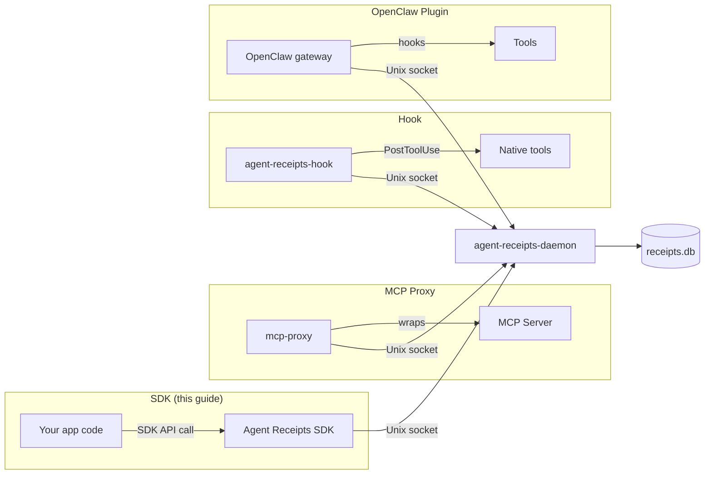

This guide walks you through creating, signing, and verifying an Agent Receipt using either the TypeScript or Python SDK.

:::caution[Not for production]
The examples below use the direct SDK signing API, which keeps the signing key inside the agent process. Anyone with code execution in the agent can forge receipts. For real deployments, use the [daemon-mediated path](/getting-started/daemon-setup/), where the daemon owns the key and your app only sends events over a socket.
:::



## TypeScript

### 1. Install

```bash
npm install @agnt-rcpt/sdk-ts
```

### 2. Create and sign a receipt

:::caution[Not for production]
This pattern keeps the signing key inside the agent process. Anyone with code execution in the agent can forge receipts. For real deployments, use the [daemon-mediated path](/getting-started/daemon-setup/).
:::

```typescript
import {
  createReceipt,
  generateKeyPair,
  signReceipt,
  hashReceipt,
} from "@agnt-rcpt/sdk-ts";

const keys = generateKeyPair();

const unsigned = createReceipt({
  issuer: { id: "did:agent:my-agent" },
  principal: { id: "did:user:alice" },
  action: {
    type: "filesystem.file.read",
    risk_level: "low",
    target: { system: "local", resource: "/docs/report.md" },
  },
  outcome: { status: "success" },
  chain: {
    sequence: 1,
    previous_receipt_hash: null,
    chain_id: "chain_session-1",
  },
});

const receipt = signReceipt(unsigned, keys.privateKey, "did:agent:my-agent#key-1");
const hash = hashReceipt(receipt);

console.log(receipt.id);  // urn:receipt:<uuid>
console.log(hash);        // sha256:<hex>
```

### 3. Store and query

```typescript
import { openStore } from "@agnt-rcpt/sdk-ts";

const store = openStore("receipts.db");
store.insert(receipt, hash);

const chain = store.getChain("chain_session-1");
console.log(`Chain has ${chain.length} receipt(s)`);

store.close();
```

### 4. Verify a chain

```typescript
import { verifyChain } from "@agnt-rcpt/sdk-ts";

const result = verifyChain(chain, keys.publicKey);
console.log(result.valid);   // true
console.log(result.length);  // number of receipts verified
```

## Python

### 1. Install

```bash
pip install agent-receipts
```

### 2. Create and sign a receipt

:::caution[Not for production]
This pattern keeps the signing key inside the agent process. Anyone with code execution in the agent can forge receipts. For real deployments, use the [daemon-mediated path](/getting-started/daemon-setup/).
:::

```python
from agent_receipts import (
    CreateReceiptInput,
    create_receipt,
    generate_key_pair,
    hash_receipt,
    sign_receipt,
)

keys = generate_key_pair()

unsigned = create_receipt(
    CreateReceiptInput(
        issuer={"id": "did:agent:my-agent"},
        principal={"id": "did:user:alice"},
        action={
            "type": "filesystem.file.read",
            "risk_level": "low",
            "target": {"system": "local", "resource": "/docs/report.md"},
        },
        outcome={"status": "success"},
        chain={
            "sequence": 1,
            "previous_receipt_hash": None,
            "chain_id": "chain_session-1",
        },
    )
)

receipt = sign_receipt(unsigned, keys.private_key, "did:agent:my-agent#key-1")
receipt_hash = hash_receipt(receipt)
```

### 3. Verify a chain

```python
from agent_receipts import verify_chain

receipts = [receipt]  # or load from storage
result = verify_chain(receipts, keys.public_key)
print(result.valid)   # True
print(result.length)  # number of receipts verified
```

## Next steps

- Read the [Introduction](/) for background on the protocol
- See the [Agent Receipt Schema](/specification/agent-receipt-schema/) for the full receipt structure
- Explore the [Action Taxonomy](/specification/action-taxonomy/) to understand action types and risk levels
- Set up `agent-receipts-hook` to capture native tool calls — see [Hook: Claude Code](/hook/claude-code/)
