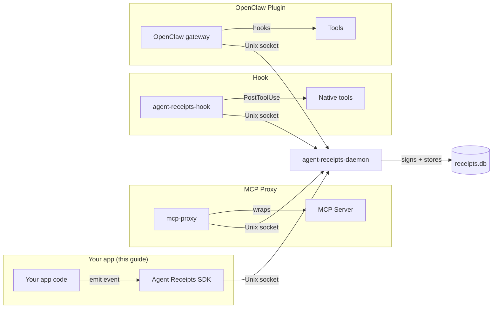

This guide walks you through emitting and verifying your first Agent Receipt with the
Python, TypeScript, or Go SDK.

Agent Receipts are signed by a separate `agent-receipts-daemon` process, not by your
application. Your code sends tool-call *events* over a local Unix socket; the daemon
holds the Ed25519 signing key, builds the receipt, signs it, and appends it to the
hash-chained store. The signing key never enters your process — so the audit trail
holds up even if the agent is compromised. This is the canonical deployment shape
([ADR-0022](https://github.com/agent-receipts/ar/blob/main/docs/adr/0022-canonical-deployment-shape.md)),
and it is the first thing you should reach for.



Each SDK section below follows the same shape: **Install → Start the daemon →
Emit a receipt → Verify.** Pick your language and work top to bottom.

## Python

### 1. Install

Install `agent-receipts-daemon` (see [Daemon Setup](/getting-started/daemon-setup/)
for your platform), then the Python SDK:

```bash
pip install agent-receipts
```

### 2. Start the daemon

Generate the signing key once, then run the daemon. It listens on the per-OS default
socket — see [Daemon Setup](/getting-started/daemon-setup/) for socket paths and
service installation.

```bash
agent-receipts-daemon --init   # one-time: creates the signing key
agent-receipts-daemon          # start the daemon (leave it running)
```

### 3. Emit a receipt

`DaemonEmitter` forwards the tool-call event to the daemon, which constructs, signs,
and chains the receipt. It is fire-and-forget — start the daemon before your app.

{/* snippet-check: no-run */}
```python
from agent_receipts import DaemonEmitter

with DaemonEmitter() as e:  # uses AGENTRECEIPTS_SOCKET or the per-OS default
    e.emit(
        channel="my-app",
        tool_name="filesystem.file.read",
        decision="allowed",
    )
```

### 4. Verify

`agent-receipts verify` reads the database directly and confirms hash linkage and
signatures — the daemon does not need to be running.

```bash
agent-receipts verify   # resolves the default chain at $XDG_DATA_HOME (falls back to ~/.local/share)
```

A successful run prints the chain length and confirms the signatures are intact. If you
started the daemon with a non-default chain id (`AGENTRECEIPTS_CHAIN_ID` / `--chain-id`)
or overrode `AGENTRECEIPTS_DB` or `AGENTRECEIPTS_PUBLIC_KEY`, pass those same values
here — otherwise `verify` reads the `default` chain at the default paths.

## TypeScript

### 1. Install

Install `agent-receipts-daemon` (see [Daemon Setup](/getting-started/daemon-setup/)
for your platform), then the TypeScript SDK:

```bash
npm install @agnt-rcpt/sdk-ts
```

### 2. Start the daemon

Generate the signing key once, then run the daemon. It listens on the per-OS default
socket — see [Daemon Setup](/getting-started/daemon-setup/) for socket paths and
service installation.

```bash
agent-receipts-daemon --init   # one-time: creates the signing key
agent-receipts-daemon          # start the daemon (leave it running)
```

### 3. Emit a receipt

`DaemonEmitter` forwards the tool-call event to the daemon, which constructs, signs,
and chains the receipt. It is fire-and-forget — start the daemon before your app.

{/* snippet-check: no-run */}
```typescript
import { DaemonEmitter } from "@agnt-rcpt/sdk-ts";

async function main() {
  const e = new DaemonEmitter();  // uses AGENTRECEIPTS_SOCKET or the per-OS default
  try {
    // emit() returns an Error for caller-bug events (bad shape), null otherwise
    const err = await e.emit({
      channel: "my-app",
      tool: { name: "filesystem.file.read" },
      decision: "allowed",
    });
    if (err) throw err;
  } finally {
    e.close();
  }
}

main().catch((err) => {
  console.error(err);
  process.exitCode = 1;
});
```

### 4. Verify

`agent-receipts verify` reads the database directly and confirms hash linkage and
signatures — the daemon does not need to be running.

```bash
agent-receipts verify   # resolves the default chain at $XDG_DATA_HOME (falls back to ~/.local/share)
```

A successful run prints the chain length and confirms the signatures are intact. If you
started the daemon with a non-default chain id (`AGENTRECEIPTS_CHAIN_ID` / `--chain-id`)
or overrode `AGENTRECEIPTS_DB` or `AGENTRECEIPTS_PUBLIC_KEY`, pass those same values
here — otherwise `verify` reads the `default` chain at the default paths.

## Go

### 1. Install

Install `agent-receipts-daemon` (see [Daemon Setup](/getting-started/daemon-setup/)
for your platform), then the Go SDK:

```bash
go get github.com/agent-receipts/ar/sdk/go
```

### 2. Start the daemon

Generate the signing key once, then run the daemon. It listens on the per-OS default
socket — see [Daemon Setup](/getting-started/daemon-setup/) for socket paths and
service installation.

```bash
agent-receipts-daemon --init   # one-time: creates the signing key
agent-receipts-daemon          # start the daemon (leave it running)
```

### 3. Emit a receipt

`NewDaemon` returns an emitter that forwards the tool-call event to the daemon, which
constructs, signs, and chains the receipt. It is fire-and-forget — start the daemon
before your app.

{/* snippet-check: no-run */}
```go
package main

import (
	"context"
	"log"

	"github.com/agent-receipts/ar/sdk/go/emitter"
)

func main() {
	e, err := emitter.NewDaemon() // uses AGENTRECEIPTS_SOCKET or the per-OS default
	if err != nil {
		log.Fatal(err)
	}
	defer func() { _ = e.Close() }()

	if err := e.Emit(context.Background(), emitter.Event{
		Channel:  "my-app",
		Tool:     emitter.Tool{Name: "filesystem.file.read"},
		Decision: "allowed",
	}); err != nil {
		log.Fatal(err)
	}
}
```

### 4. Verify

`agent-receipts verify` reads the database directly and confirms hash linkage and
signatures — the daemon does not need to be running.

```bash
agent-receipts verify   # resolves the default chain at $XDG_DATA_HOME (falls back to ~/.local/share)
```

A successful run prints the chain length and confirms the signatures are intact. If you
started the daemon with a non-default chain id (`AGENTRECEIPTS_CHAIN_ID` / `--chain-id`)
or overrode `AGENTRECEIPTS_DB` or `AGENTRECEIPTS_PUBLIC_KEY`, pass those same values
here — otherwise `verify` reads the `default` chain at the default paths.

## Appendix: in-process signing (tutorial and testing only)

The SDKs can also create and sign a receipt entirely in your process, with no daemon.
This is useful for learning the receipt API and for unit tests that should not depend
on a running daemon.

:::danger[Not for production]
This pattern keeps the signing key inside the agent process. Anyone with code execution
in the agent can forge receipts. For real deployments, use the daemon-mediated path
shown above (see also [Daemon Setup](/getting-started/daemon-setup/)).
:::

```python
from agent_receipts import (
    CreateReceiptInput,
    create_receipt,
    generate_key_pair,
    sign_receipt,
    verify_receipt,
)

keys = generate_key_pair()

unsigned = create_receipt(
    CreateReceiptInput(
        issuer={"id": "did:agent:my-agent"},
        principal={"id": "did:user:alice"},
        action={
            "type": "filesystem.file.read",
            "risk_level": "low",
            "target": {"system": "local", "resource": "/docs/report.md"},
        },
        outcome={"status": "success"},
        chain={
            "sequence": 1,
            "previous_receipt_hash": None,
            "chain_id": "chain_session-1",
        },
    )
)

receipt = sign_receipt(unsigned, keys.private_key, "did:agent:my-agent#key-1")

valid = verify_receipt(receipt, keys.public_key)
print(f"Signature valid: {valid}")  # True
```

The equivalent TypeScript and Go signing APIs are documented in each SDK README
([TypeScript](https://github.com/agent-receipts/ar/tree/main/sdk/ts),
[Go](https://github.com/agent-receipts/ar/tree/main/sdk/go)). The same
"not for production" caveat applies to all of them.

## Next steps

- Read the [Introduction](/) for background on the protocol
- Follow [Daemon Setup](/getting-started/daemon-setup/) for install, socket paths, and running the daemon as a service
- See the [Agent Receipt Schema](/specification/agent-receipt-schema/) for the full receipt structure
- Explore the [Action Taxonomy](/specification/action-taxonomy/) to understand action types and risk levels
- Set up `agent-receipts-hook` to capture native tool calls — see [Hook: Claude Code](/hook/claude-code/)
