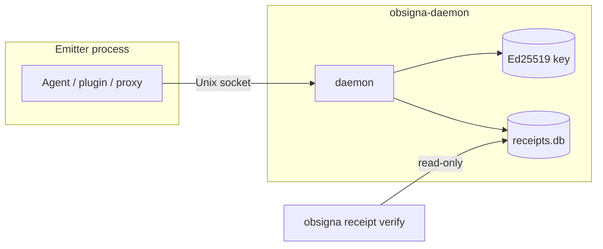

An agent runs overnight. By morning, a customer's production data is gone — the agent called a cleanup tool with the wrong scope and deleted records it was never meant to touch. The first question everyone asks is the simplest one: what exactly did it do, on whose authority, and with what inputs? You open the logs and find a single line — "maintenance task completed." Nothing about the destructive call. Nothing about who approved it. And no way to prove the log itself wasn't edited afterward.

**Agent Receipts** closes that gap. A separate daemon records a tamper-evident receipt for every tool call your agent makes. The signing keys and the receipt store live outside the agent process, so the audit trail holds up even if the agent is compromised.

## The protocol

An **Agent Receipt** is a cryptographically signed record of a single action taken by an AI agent on behalf of a human. Each receipt is structured as a [W3C Verifiable Credential](https://www.w3.org/TR/vc-data-model-2.0/) with type `AgentReceipt`, signed with Ed25519, and hash-chained into a tamper-evident log.

Every receipt captures:

- **Who** — the agent that acted and the human who authorized it
- **What** — the action type (from a standardized taxonomy) and its risk level
- **When** — timestamps, optionally backed by a trusted third-party timestamp authority
- **Outcome** — success, failure, or pending — and whether the action is reversible
- **Chain position** — a hash link to the previous receipt, forming a tamper-evident sequence

Parameters are hashed, not stored in plaintext. The operator controls what is disclosed.

## Design principles

The protocol is privacy-preserving by default, built on existing standards (W3C VCs, Ed25519, SHA-256, RFC 3161), agent-agnostic, and minimal by default with room for domain-specific extensions. The EU AI Act mandates traceability for high-risk AI systems (Article 12); Agent Receipts produces a record that meets that bar.

See the [Specification Overview](/specification/overview/) for the full design.

## Explore the spec

- [How It Works](/specification/how-it-works/) — architecture and flow
- [Trust Model](/specification/trust-model/) — threat model and guarantees
- [Agent Receipt Schema](/specification/agent-receipt-schema/) — the full receipt structure
- [Action Taxonomy](/specification/action-taxonomy/) — standardized action types and risk levels
- [Receipt Chain Verification](/specification/receipt-chain-verification/) — tamper-evidence guarantees
- [Parameter Disclosure](/specification/parameter-disclosure/) — privacy-preserving payload handling
- [Spec (full text)](/spec/) — versioned canonical specification

## Use the tooling

The [obsigna.dev](https://obsigna.dev) site covers the concrete implementations: SDKs (Go, TypeScript, Python), the MCP proxy, the hook, and the dashboard.

For the agent security tooling landscape — how Agent Receipts fits alongside observability platforms, policy engines, and other approaches — see the [Ecosystem](/ecosystem/).
