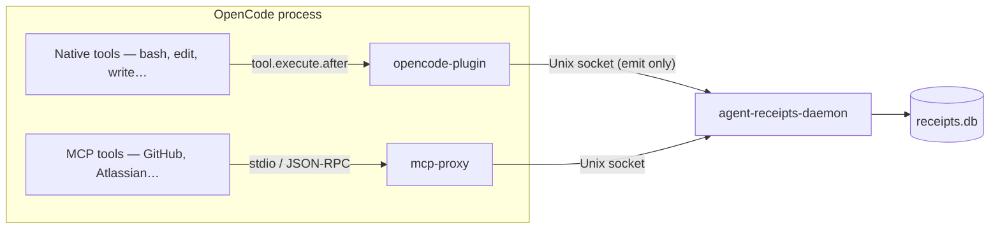

[OpenCode](https://opencode.ai) is a model-agnostic coding agent. Agent Receipts captures its activity across **two channels**, mirroring the [Claude Code](/hook/overview/) setup:

- **Tier A — MCP tools** go through [`mcp-proxy`](/opencode/mcp-proxy/). This is the *ingress-egress*, adversary-resistant placement: the proxy runs out-of-process and signs locally, so it holds even against a misbehaving agent. Docs-only — it reuses a shipped component.
- **Tier B — native tools** (`bash`, `edit`, `write`, `webfetch`, …) go through the **`@agent-receipts/opencode-plugin`** plugin. This is the *execd-side*, honest-operator placement: maximum coverage of native calls, emitted to the daemon for signing.

## Trust model — read this first

The plugin runs **inside** the OpenCode process, so it is an **emitter only**. It forwards each tool call to `agent-receipts-daemon`, which holds the key, canonicalises (RFC 8785), signs (Ed25519), and chains the receipt ([ADR-0010](https://github.com/agent-receipts/ar/blob/main/docs/adr/0010-daemon-process-separation.md)). The plugin **never signs and never holds a key**.

This placement is **honest-operator-grade**, not adversary-resistant. The agent controls the plugin, so a compromised OpenCode can omit or misreport a native tool call. If you need a placement that holds against the agent itself, route those tools through MCP and the proxy (Tier A). The two tiers are complementary: Tier A is adversary-resistant for the MCP channel; Tier B maximises coverage of the native channel.

## How the plugin works

OpenCode exposes a [plugin API](https://opencode.ai/docs/plugins/) (`@opencode-ai/plugin`) with `tool.execute.before`/`tool.execute.after` hooks. The plugin:

1. Records each call's **intent/params** in `tool.execute.before`.
2. On `tool.execute.after`, builds one event — channel `opencode`, the tool name, the resolved action type, the input args, the output, and `decision: "allowed"` — and emits it to the daemon over a Unix socket.
3. Releases the per-session socket on `session.deleted` (and on plugin teardown). It deliberately does *not* release on `session.idle`, which OpenCode fires after every turn rather than at session end.

The daemon hashes the input args (`parameters_hash`, RFC 8785) — cleartext parameters are never stored.

## Action mapping

The plugin resolves each OpenCode tool name to an [action taxonomy](/specification/action-taxonomy/) type and forwards it to the daemon as `action_type`:

| OpenCode tool | Action type | Risk |
|---|---|---|
| `bash` | `system.command.execute` | high |
| `write` | `filesystem.file.create` | low |
| `edit`, `patch` | `filesystem.file.modify` | medium |
| `read`, `glob`, `grep`, `list` | `filesystem.file.read` | low |
| `webfetch` | `data.api.read` | low |
| *(unmapped)* | `opencode.<tool>` (daemon fallback) | medium |

The daemon re-derives `risk_level` from the type, so a mislabelled call cannot downgrade its own risk to evade parameter disclosure. Override or extend the map via config (see [Installation](/opencode/installation/#configuration)).

## Chain mapping

Each OpenCode `sessionID` gets its own emitter, so every receipt carries the originating session id and all of a session's calls group together in the daemon chain.

:::note[Subagent sub-chains — follow-up]
Per-agent **sub-chains** with `delegation` backlinks ([#753](https://github.com/agent-receipts/ar/issues/753)) are not yet wired. The `tool.execute` hook context exposes only `{ tool, sessionID, callID }` — not a named-agent identity — so the sub-chain keying cannot be derived without guessing. Subagent child sessions still produce receipts; they are grouped by their own session id rather than linked to the parent chain. This is a deliberate, filed follow-up.
:::

## Difference from mcp-proxy

| | mcp-proxy (Tier A) | opencode-plugin (Tier B) |
|---|---|---|
| **Covers** | MCP tool calls | Native host tool calls |
| **Placement** | Out-of-process | Inside OpenCode |
| **Adversary-resistant** | Yes | No — honest-operator |
| **Signing** | In-proxy Ed25519 | Daemon signs (emit only) |
| **Policy enforcement** | Yes — pass, flag, pause, block | No — emits after the tool ran |

## Failure posture

Default is **catch-and-warn** (ADR-0025): a tool call is never aborted because the daemon is unreachable — the drop is logged loudly. Best-effort emission means a daemon outage produces a **chain gap**, not a completeness guarantee. Set `AGENT_RECEIPTS_STRICT=1` to surface emit failures instead. See [Installation](/opencode/installation/#failure-posture).
