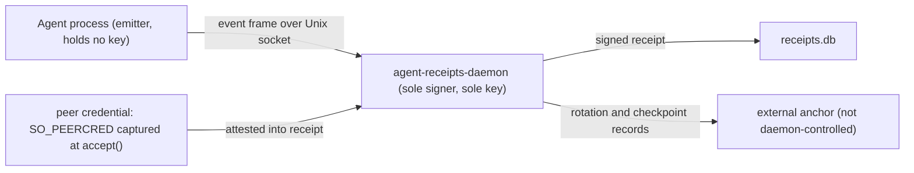

Agent Receipts separates **mechanism** from **policy**. The mechanism is fixed: a
canonical receipt (RFC 8785), an Ed25519 signature over its canonical bytes, and
a hash chain linking each receipt to its predecessor. The policy — *where the
signing authority sits relative to the agent* — is a deployment choice the
operator makes.

This distinction matters because it is easy to mistake one deployment for the
protocol. Agent Receipts does **not** place the signing key anywhere. The
deployment does. The same receipt format and the same verifier work whether the
key lives inside the agent process, inside a separate daemon the agent cannot
read, or inside an HSM the daemon itself cannot extract.

## Who signs is not who acted

Four roles are deliberately distinct. Collapsing them is the most common source
of confusion about what a receipt proves.

| Role | What it is | Where it appears |
|---|---|---|
| **Issuer** (`issuer.id`) | An identity claim — the agent or platform on whose behalf the action was recorded. A *subject* of the receipt, not necessarily the key holder. | Receipt body |
| **Operator** (`issuer.operator`) | The entity running the agent or host. Orthogonal to the signer. | Receipt body |
| **Signer** | The process that holds the private key and produces the signature. | Outside the receipt — a deployment fact |
| **Key custody** (`KeySource`) | Where the private key physically lives: a file, an HSM, or a cloud KMS. May be non-extractable. | Configured per deployment |

In the daemon deployment (below), the signer attests the agent's identity rather
than *being* it: the daemon captures the connecting process's OS credentials
(`SO_PEERCRED` / `LOCAL_PEERCRED`) at connection time and records them in
`action.peer_credential`, signed. The agent's self-asserted identity is never
trusted; it is witnessed. A receipt is therefore not "the agent vouching for
itself" — it is the signing authority vouching for what it independently
observed the agent do.

## The trust boundary is a dial

There is no single trust boundary. There is a dial the operator turns, trading
deployment simplicity for stronger isolation of the key.

| Deployment | Signer location | Boundary drawn at | What the operator is choosing to defend against |
|---|---|---|---|
| **In-process (SDK)** | Agent *is* the signer | agent + operator ↔ external verifier | Downstream tampering and portability. The agent host is *trusted* in this model. |
| **Daemon-isolated** (default for the MCP proxy and hook) | Separate OS user; key unreachable by the agent | agent ↔ signing authority | A compromised or lying agent process. |
| **HSM / cloud KMS** (`KeySource` backend) | Key non-extractable even from the daemon host | operator / host ↔ verifier (with external anchor) | A compromised operator, root, or daemon. |

Each row is a legitimate choice, not a ladder of "wrong" to "right." An operator
who trusts the agent host and only needs tamper-evidence against downstream
parties may deliberately pick in-process signing for its portability — accepting
that code execution in the agent can forge receipts, because in that model the
agent is inside the trust boundary by design. An operator defending against a
compromised agent picks the daemon. An operator defending against their own
infrastructure picks HSM/KMS plus an external anchor.

## The default: daemon-isolated signing

The production integration surfaces — the MCP proxy and the PostToolUse hook —
ship as **thin emitters with no key material of their own**. They fire a
fire-and-forget event frame over a local Unix socket; a separate
`agent-receipts-daemon` process builds, canonicalizes, signs, and stores the
receipt ([ADR-0010](https://github.com/agent-receipts/ar/blob/main/docs/adr/0010-daemon-process-separation.md)).

This boundary is enforced in code, not merely asserted:

- The daemon **refuses to load a key** whose file mode grants any group or world
  access (`perm & 0o077 != 0` → refuse; requires `0600`).
- The key file is opened `O_NOFOLLOW` with an `fstat` on the descriptor, closing
  the symlink-swap TOCTOU window.
- Peer credentials are captured at `accept()` — before any frame is read — so a
  forking emitter cannot mislabel itself.
- The emitter binaries contain no Ed25519, key-generation, or key-loading code
  paths at all.

The consequence: **a compromised agent cannot read the signing key, write the
store, canonicalize, or forge a signature.** The worst it can do is lie in the
fields it sends — and the daemon records that lie next to the OS-attested ground
truth of which process sent it.

## Defending against a compromised operator

The daemon boundary defends against the agent. Defending against the *operator*
— or against a daemon that has itself been compromised — is a different boundary,
and Agent Receipts answers it with two interlocking constructs from
[ADR-0015](https://github.com/agent-receipts/ar/blob/main/docs/adr/0015-key-rotation-byok-anchoring.md):

1. **Non-extractable key custody.** The `KeySource` interface lets the signing
   key live in an HSM (PKCS#11) or a cloud KMS, where the daemon submits
   canonical bytes for signing and never holds the key. Compromising the daemon
   host no longer yields the key.

2. **External anchoring.** Key-rotation events are written **anchor-first** —
   to a sink the daemon does not control — *before* the local chain commits, and
   periodic checkpoints commit the chain tip to that same sink. A sink only
   qualifies if it is append-only and orders/timestamps records itself
   (object-lock storage, a transparency log, a sequence-stamping SIEM). With such
   a sink, an attacker who compromises the daemon key can forge only *future*
   receipts under that key; the chain's history, its rotation lineage, and its
   tail are fixed by witnesses the attacker cannot rewrite.

Together these move the post-compromise integrity *witness* off the operator's
side of the boundary — which is precisely the property a self-signed scheme
cannot have on its own.

:::caution[Implementation status]
Lead-with-the-design above describes the target architecture. As shipped today:

- **Key rotation** and **anchor-first rotation writes** are implemented, with a
  dependency-free **file-log reference adapter**. That adapter appends, but a
  plain file is only as tamper-evident as the filesystem around it — it is for
  development and for fronting a medium that enforces append-only retention.
- **Production anchor adapters** (S3 object-lock, transparency log, SIEM ingest)
  and **checkpoint anchoring** for tail-truncation detection (ADR-0015 Phase B)
  are **not yet shipped**.
- **HSM / cloud-KMS `KeySource` backends** (Phase C) are designed but not yet
  shipped; the file-backed adapter is the current default.

So post-compromise integrity is **conditional on configuring a qualifying
external sink**, and that ecosystem is still landing. The agent-isolation
boundary (the previous section) is fully shipped; the operator-isolation
boundary is partially shipped. We state both rather than blur them.
:::

## Verification is uniform across all models

A verifier does not need to know which deployment produced a receipt. It checks
the Ed25519 signature against the issuer's public key, recomputes the canonical
bytes (RFC 8785), and walks `chain.previous_receipt_hash` — and, across
rotations, the inline `keyRotation.new_public_key` witness. The trust model an
operator chose changes *what a valid receipt lets you conclude about a
compromised agent or operator*; it does not change *how* you validate one.

## Summary

- The receipt mechanism is fixed; trust-boundary placement is a deployment
  parameter.
- "The agent platform signs, so the key is on the operator's side" describes one
  point on the dial — not the protocol, and not the shipped default.
- The default daemon deployment puts the signer outside the agent, under its own
  OS user, with a key the agent cannot reach, and attests the agent's identity
  rather than trusting it.
- Defending against the operator is a separate, designed boundary
  (non-extractable custody + external anchoring) that is partially shipped today;
  we mark exactly what is and is not in place.
