# Agent Receipt Structure

```mermaid
block-beta
  columns 1

  block:receipt["Agent Receipt (W3C Verifiable Credential)"]
    columns 3

    context["★ @context\n[VC v2, Agent Receipt]"]
    id["★ id\nurn:receipt:uuid"]
    type["★ type\n[VerifiableCredential,\nAgentReceipt]"]

    version["★ version\n0.1.0"]
    issuer["★ issuer\nid · type · name\noperator · model\nsession_id"]
    validFrom["★ validFrom\nISO 8601"]

    block:cs["★ credentialSubject"]:3
      columns 2

      principal["★ principal\nid · type"]
      action["★ action\nid · type · risk_level\ntimestamp · target\nparameters_hash"]

      intent["intent\nconversation_hash\nprompt_preview\nreasoning_hash"]
      outcome["★ outcome\nstatus · error\nreversible · reversal_method\nreversal_window_seconds\nreversal_of · state_change"]

      authorization["authorization\nscopes · granted_at\nexpires_at · grant_ref"]
      delegation["delegation\nparent_chain_id\nparent_receipt_id\ndelegator"]

      chain["★ chain\nchain_id · sequence\nprevious_receipt_hash"]:2
    end

    block:proof["★ proof"]:3
      columns 1
      proofFields["type: Ed25519Signature2020 · created · verificationMethod · proofPurpose · proofValue"]
    end
  end

  style cs fill:#1a1a2e,stroke:#7c93f5
  style proof fill:#1a1a2e,stroke:#a5d6a7
```

**Legend:** ★ = required. Sections without ★ are optional. Within each section, see the [schema page](https://agentreceipts.ai/site/specification/agent-receipt-schema/) for per-field requirements.
