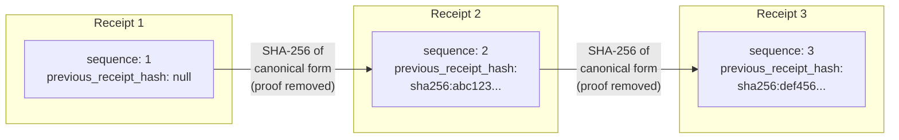
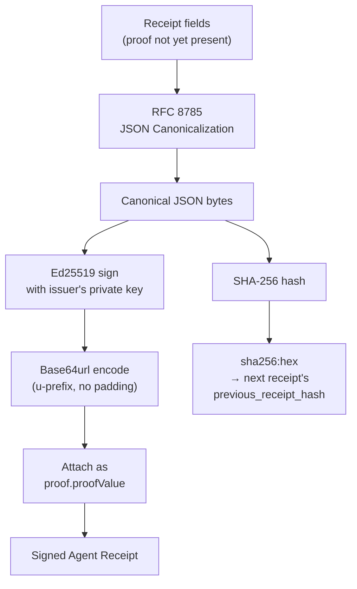
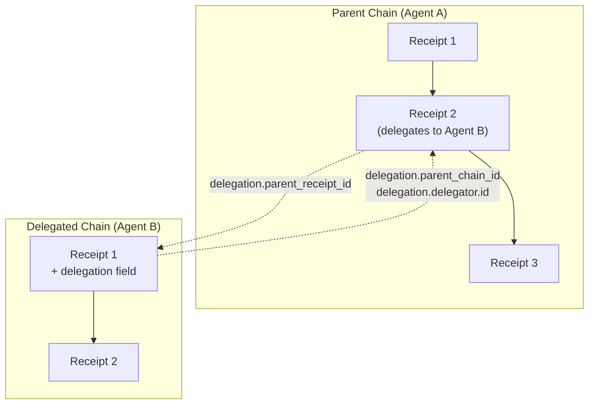

# Receipt Chain Linking and Signing

## Chain hash linking

All receipts in a chain share the same `chain_id` and `issuer.id`.

## Signing flow

## Delegation linking

The delegated chain carries a `delegation` field on its first receipt, linking back to the parent chain. Both chains share the same `principal` (the human who authorized the work).
